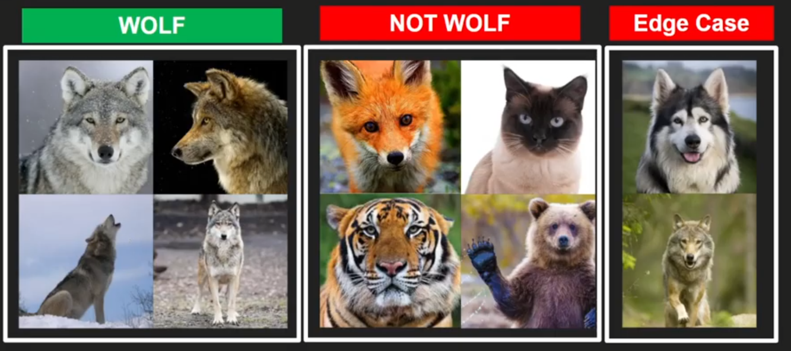

# Module 1 Notes For AIM 100

# What is AI

A computer system doing things that normally would require human intelligence.

# Types of AI

1. **Artificial Narrow Intelligence**
    - AI that simulates human intelligence at <u>one thing</u>
    - **Example:** When your camera can recognize you're in the camera frame and
      blur the background.
2. **Artificial General Intelligence**
    - AI that simulates human intelligence at <u>everything</u>
    - _Much less developed. Think Terminator and human-robots._

# General Notes

- [Syllabus](https://docs.google.com/presentation/d/18eNwOzWN99bpyex80OT1s_XhGAGPRnr3FIOHm7wtrzw/edit#slide=id.g1cf0eec0226_0_60)
- [AI Lecture Slideshow](https://docs.google.com/presentation/d/18eNwOzWN99bpyex80OT1s_XhGAGPRnr3FIOHm7wtrzw/edit#slide=id.g1cf0eec0226_0_60)
- [Goal-setting Article](https://legionathletics.com/goal-setting/)

## Wolf Example

```java
wolf_classifier() {
    // Does it have two ears?
    // Does it have wiskers?
    // Does it have four legs?
    // Does it have a grey pelt?
}
```

- Classifier depicts one thing from another.
- If all the values are true, it's classified as a "wolf".



The issue with this classifier is that it will not be able to differentiate
between a wolf and a dog that looks like a wolf.

- The way to get around this is **Supervised Learning**.

## Academic Pathway

- [CGC AI Page](https://cgc.edu/ai)
- [Academic Flowchart](https://www.cgc.edu/sites/default/files/documents/programs/program/aas-aim-flow-chart.pdf)
- [CGC Degree](https://www.cgc.edu/degrees-certificates/science-technology-engineering-and-mathematics/artificial-intelligence-and-machine-learning-3891-aas)


- AI involves a lot of math.

## AI Libraries

- [OpenVINO](https://www.intel.com/content/www/us/en/developer/tools/openvino-toolkit/overview.html)
    - [Documentation](https://docs.openvino.ai/latest/home.html)
- [Pandas](https://pandas.pydata.org/pandas-docs/stable/index.html)
- [OpenCV](https://opencv.org/)
- [Scikit-Learn](https://scikit-learn.org/stable/)
- [Numpy](https://numpy.org/devdocs/user/absolute_beginners.html)
- [PyTorch](https://pytorch.org/)
- [Keras](https://keras.io/)
- [Natural Language Toolkit](https://www.nltk.org/)
- [Hugging Face](https://huggingface.co/)

# Labs

- [Lab Link](https://docs.google.com/document/d/1P2ve1qDytlvSGGVHduZVrIEfwpN8OsR5NU6GtpLQPYs/edit#)
    - [What is Machine Learning](https://learn.microsoft.com/en-us/azure/machine-learning/overview-what-is-azure-machine-learning#studio)
    - [Creating a No-Code Regression Model](https://learn.microsoft.com/en-us/azure/machine-learning/tutorial-designer-automobile-price-train-score)
- [Azure Studio Classic](https://studio.azureml.net/)


- For the automotive lab, you will need to use the **Filter Based Feature 
  Selection** node with the Raw data from the first node as its input in order
  to see the feature weights.
  - After it's done: `Right click > Preview Data > Features`

## Model Example

- [Student Grades](assets/student_grades.csv)


When working with models, first create a dataset to train your model, and
another dataset for testing real world data to determine accuracy.

- This can be done by splitting your dataset if you only have the one.
    - A 70/30 split is a good base.

## Useful Terms

- **Mean Absolute Error (MAE):** The average of absolute errors. An error is the
  difference between the predicted value and the actual value.
- **Root Mean Squared Error (RMSE):** The square root of the average of squared
  errors of predictions made on the test dataset.
- **Relative Absolute Error:** The average of absolute errors relative to the
  absolute difference between actual values and the average of all actual
  values.
- **Relative Squared Error:** The average of squared errors relative to the
  squared difference between the actual values and the average of all actual
  values.
- **Coefficient of Determination:** Also known as the R squared value, this
  statistical metric indicates how well a model fits the data.

## Linear Regression

Linear regression uses a <u>straight line</u>:


- The plotted points are **observations**.
- The regression line is based on the <u>least squares method</u>.

The goal is to minimize the errors between the estimated value and the actual
value:


### Positive Relationship


- **b<sub>0</sub>** is the **Y-Intercept** and **b<sub>1</sub>** is the slope.
- **Y** is the **Dependent Variable**
  - The outcome
- **X** is the **Independent Variable** and is what we:
  - control
  - change
  - manipulate

### Negative Relationship


- **b<sub>0</sub>** is the **Y-Intercept** and **b<sub>1</sub>** is the slope.
- **Y** is the **Dependent Variable**
  - The outcome
- **X** is the **Independent Variable** and is what we:
  - control
  - change
  - manipulate
