# Module 2 Notes for AIM100

# General Notes

- What we have that ancient philosophers didn't is **data**. Data is the fuel of
  AI.
- [AI Rock Paper Scissors](https://next.rockpaperscissors.ai/)
- [ImageNet](https://www.image-net.org/)
- [Emoji Scavenger Hunt](https://emojiscavengerhunt.withgoogle.com/)
- [Google's Vision AI](https://cloud.google.com/vision)
  - An example of why a computer would inaccurately depict an image is due to 
    something like pixelation from being behind a window, or some other 
    hindrance.

# Data

> [Google Slides](https://docs.google.com/presentation/d/1_nLXsMcKWBXRB16wuSpdFcUic7i7FwusfFwIicl8qJI/edit#slide=id.gdcc6f0807a_2_78)

There are many different sources of data, such as:

- Web / social _(Facebook, Twitter, Instagram, YouTube)_
- Biometric Data (fitness, trackers, genetic tests)_
- Internet of Things or **IOT** _(ID tags and smart devices)_
- Cloud Systems _(business applications like salesforce.com or Amazon)_
- Corporate databases and Spreadsheets

## Types of Data

There are two ways to organize data:

### Structured Data

- Financial information
- Social security numbers
- Addresses
- Product Information
- Phone numbers

Structured data is easier to work with and often comes from CRM's, and usually
has lower volume, and they are straightforward.

- THis type counts to about 20% of an AI project.
- You know how the data will be coming to you.

### Unstructured Data

- Images
- Audio files
- Text files
- Tweets and posts
- Satellite images

The majority of the data comes from unstructured data, which is information
that has no predefined formatting.

## Types of Data Levels

| Value            | Abbreviation |             Storage              | Use Case                                                                                     |
|:-----------------|:------------:|:--------------------------------:|:---------------------------------------------------------------------------------------------|
| **Bit**          |    **b**     | **Binary Digit, Single 1 or 0**  | -                                                                                            |
| **Nibble**       |    **-**     |            **4 bits**            | -                                                                                            |
| **Byte / Octet** |    **B**     |            **8 bits**            | -                                                                                            |
| **Kilobyte**     |    **KB**    | **1024 bytes or 103** | -                                                                                            |
| **Megabyte**     |    **MB**    |  **1024 KB or 106**   | A small book                                                                                 |
| **Gigabyte**     |    **GB**    |  **1024 MB or 109**   | About 230 songs                                                                              |
| **Terabyte**     |    **TB**    |  **1024 GB or 1012**  | 500 hours of movies                                                                          |
| **Petabyte**     |    **PB**    |  **1024 TB or 1015**  | Five years of the **Earth Observing System (EOS)**                                   |
| **Exabyte**      |    **EB**    |  **1024 PB or 1018**  | The entire Library of Congress 3,000 times over                                              |
| **Zettabyte**    |    **ZB**    |  **1024 EB or 1021**  | 36,000 years of HD-TV video                                                                  |
| **Yottabyte**    |    **YB**    |  **1024 ZB or 1024**  | This would require a data center the size of Delaware and Rhode Island combined. |

### Evolution of Data

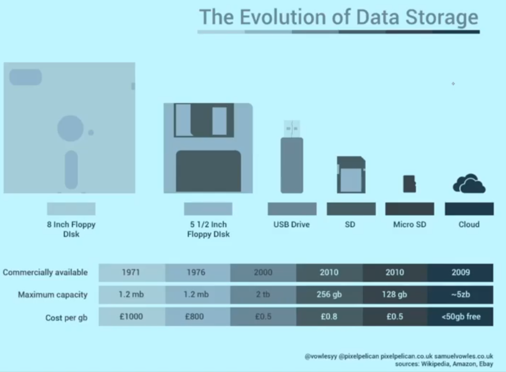

### Big Data

<u>Fun Facts:</u>

- Every second, Google processes over 40,000 searches or 3.5 billion a day.
- On a minute-by-minute basis, Snapchat users share 527,760 photos.
- Every minute, there arte 156 million email messages sent.
- 4.1 million videos users watch on YouTube per minute.

### Data Science Illustration

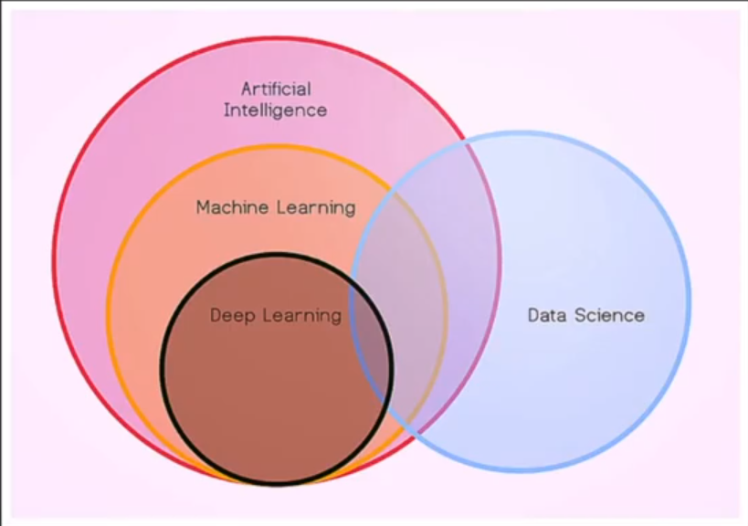

- **Artificial Intelligence:** Work and react like humans.
- **Machine Learning:** Create tools to extract knowledge from data.
- **Deep Learning:** Use the way our brain works to perform advanced analysis.

## Data Characteristics

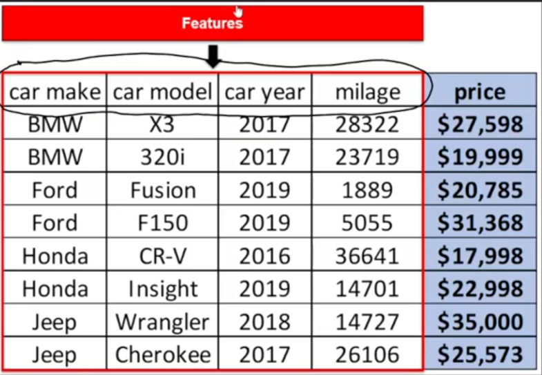

- **Features:** Properties of the data used for prediction
- **Correlation:** How relevant the data is to the goal of the program
    - This is a <u>broad</u> definition.
- **AI Goal:** The goal of the AI.
    - In this case, it's to predict car prices.
- **Frequency of Data:** How quickly the data is updated.
    - Is high frequency of data important to the goal of the ai?
    - There are certain scenarios where it is a requirement, and other times when
      the frequency of data can be slower. This needs to be decided as well.
- **Period of Data:** The length of time we need to keep the data for our uses.
- **Trend of Data:** The story the data is telling us about our goal

---

### Correlations - Examples

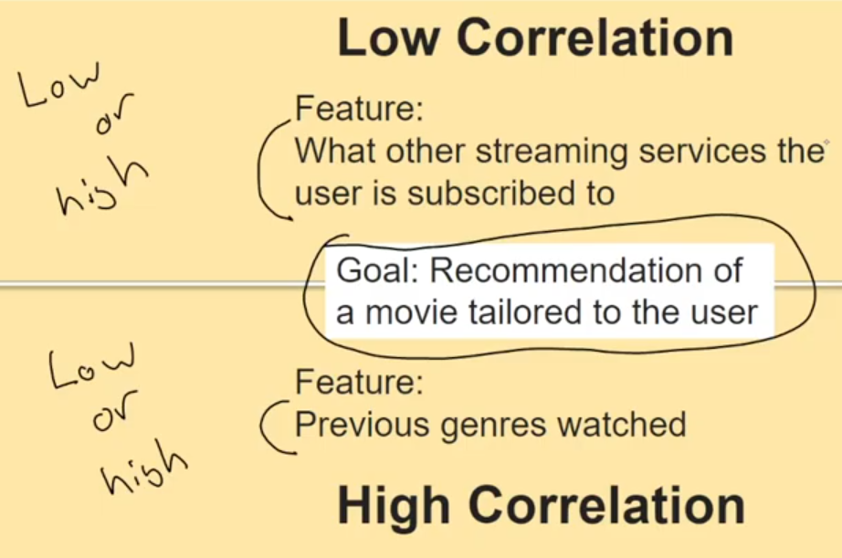

#### Different Scenarios For Highly Correlated Features

- Helping farmers determine best times for seeing / sowing their crops
    - Rainfall
    - Temperature
    - Humidity
    - Price of water
    - Location of farm
- Preserving the Great Wall of China more efficiently
    - Amount of rainfall
    - Images of the wall
    - Tourist Data
    - Temperature
- Reducing illegal poaching of elephant trunks
    - Sales price of tusks
    - Location of poachers
    - Location of elephants
    - Information about demand of tusks
- Predicting whether a song makes it to the billboard
    - Tempo of music
    - Current trends
    - Genre of music
    - Duration of song
- Improving the exam scores of students
    - How far students live
    - How do students spend their time
    - Hobbies of students
    - How much time they spend in school
    - How enjoyable they find a lesson

---

## Data Exploration

**Exploring Data** - Gives us a sense of trends/patterns between other sets of
data.

- When choosing a book, you look at the front cover / back cover, table of
  contents, and you may skim through. Building an idea of what its use will be
  to you.

### Visualization - Data Exploration

Visualisation makes it easier to understand and communicate with others.

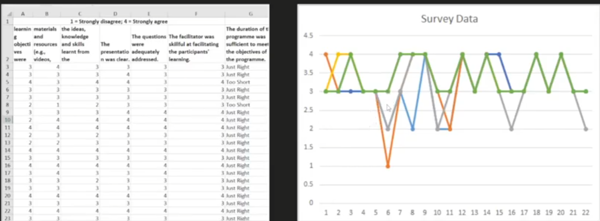

## Summary

1. Structured data is labeled and formatted
2. Unstructured data is information that has no predefined formatting
3. Big data describes a way to handle huge amount of volumes of information
4. Quantity of data is certainly important, but there also needs to be much work
   on the quality. Even small errors can have a huge impact on the results of
   an AI model.

# Computer Vision (Domains of AI)

> [Google Slides](https://docs.google.com/presentation/d/1ZS2jcHm1x_mXLrESR-BqwakTX9FwnKnzNg_c1V5wuIY/edit#slide=id.p1)

YouTube
Video: [How computers learn to recognize objects instantly | Joseph Redmon](https://www.youtube.com/watch?v=Cgxsv1riJhI)

- **Image Classification:** Is taking an image and applying a label to it.
- **Object Detection:** Finding the objects in an image, putting a bounding box
  around them, and identifying them.
- **YOLO:** You Only Look Once
    - The old methods of object detection used to take portions of images and
      look for similarities in photos, then combining all those found similarities,
      analyzing an image thousands of times. The new method of **YOLO** only looks
      at the image once.

## CV Applications

- Autonomous vehicles
- Fingerprint sensor
- Facial recognition

## Computer Vision Definition

> _Computer Vision as a field is an intellectual frontier. Like any frontier, it
> is exciting and disorganized, and there is often no reliable authority to
> appeal to. Many useful ideas have no theoretical grounding, and some theories
> are useless in practice; developed areas are widely scattered, and often one
> looks completely inaccesible from the other._  
> -- Computer Vision: A Modern Approach

- Traditional CV uses features to provide understanding of the context within
  the image data.

## Computer Vision Tasks

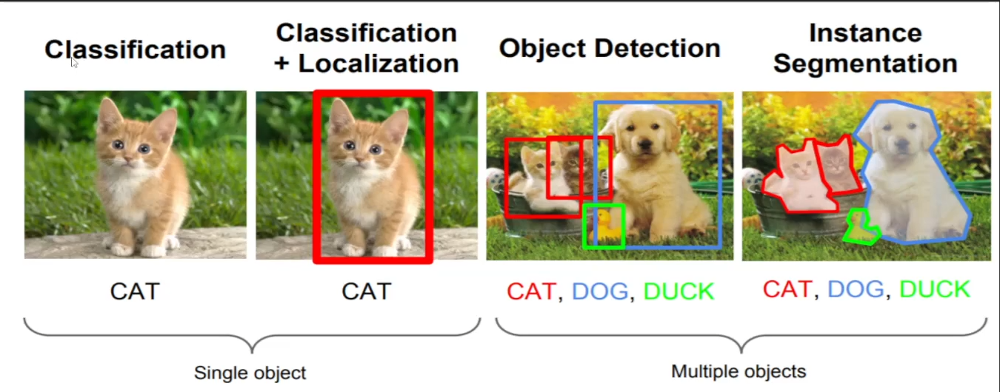

- **Classification:** Says what selection in the photo out of all the possible
  selections that it has.
- **Localization:** Localizes the classified object to a specific place in the
  image.
- **Object Detection:** Depicts multiple objects in a photo.
    - Programs are designed to take what's most prominent in the photo and depict
      that back to the user.
    - It's better to have a space of where an object is and classify it than
      to have an outline.
- **Instance Segmentation:** When not only is an object detected in the photo,
  it's outlined as well.
    - With the precision, you lose a lot of efficiency.

In something like a self-driving car, a bounding box is better than instance
segmentation, because you need efficiency. However, in something like surgery,
you'd want very precise cutouts using instance segmentation.

## Edge Detection (Traditional Task)

Edge detection takes the differences and intensity of the pixels in a photo,
where there are large changes in color, and depicts it with a line and records
all the large changes in the photo.

- Edge detection is a **traditional method**

### Original Image

- Some methods to depict the girl in this photo:
    - Color
    - Edge detection

### Edge Detection Applied

- This method is called **canny edge detection**.

## Traditional Computer Vision

Provide some form of understanding of context within image data.

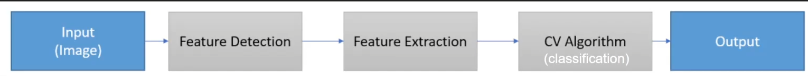

- **Features:** Measurable and quantifiable piece of information within forms of
  data that define certain characteristics of an observation.
    - Example: **Edge Detection**
        - Identify points within the image where pixel intensity changes sharply
- The efficiency of traditional CV techniques are heavily reliant upon the
  quality of the detected and extracted features.
- Also reliant upon the algorithms to tie those features together into a scenic
  understanding of the photo.
- Traditional methods are great for specified projects where it fits the
  specific scenario, but traditional methods are not very general purpose.
    - Traditional methods may seem outdated because of generalized new methods,
      but they are better for specific domains, whereas generalized ones are great
      for general domains.
- With traditional, you need to specify what things matter, like the color, the
  edges of the image, the distance between the eyebrows, etc.

### Example: Haar-like Features

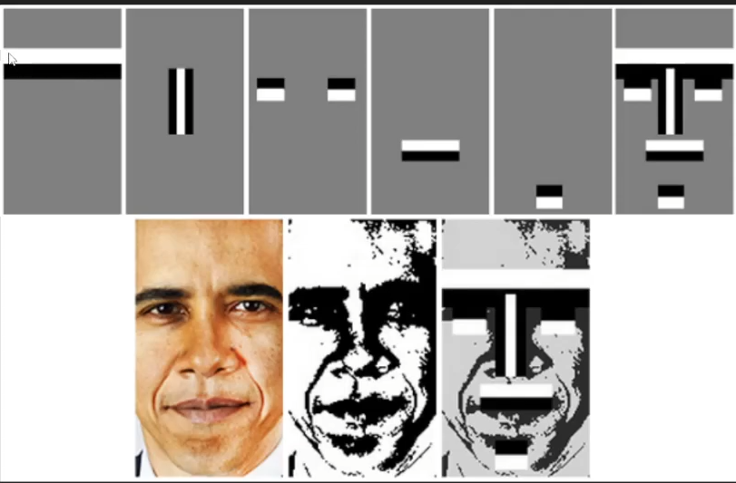

- Two adjacent rectangles where the differences between the sum of pixel
  intensities in each rectangle are used to identify segments of the face.

## Deep Learning Approach

- Most computer vision related tasks are solved using deep learning architectures
  (Neural Networks).
- Deep learning automates the process of feature engineering, extraction, and
  classification.

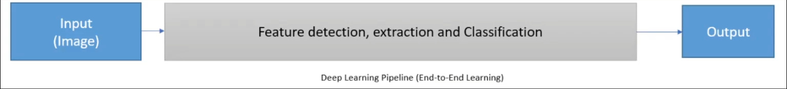

## Deep Learning vs Traditional

|                 Differences                 | Deep Learning | Traditional |
|:-------------------------------------------:|:-------------:|:-----------:|
|     Manual Feature Extraction Required?     |     **X**     |    **✔**    |
| Is Training Computationally Resource Heavy? |     **✔**     |    **X**    |
|      Requires Huge Labelled Datasets?       |     **✔**     |    **X**    |
|              Black Box Models?              |     **✔**     |    **X**    |
|   Easy To Deploy Even On Microprocessors?   |     **X**     |    **✔**    |
|         Yields High Accuracy Rates?         |     **✔**     |    **X**    |

- A **Black Box** is used in systems engineering. A black box is when you know 
  the input & output of a system, but not the inner workings (such as a 
  toaster).
- With deep learning, it takes an expert touch to backtrack and understand why
  a certain decision was made. With Traditional CV, you can backtrack and look
  at why a decision was made.
- When deep learning gets large, it needs a GPU.
  - This can be offloaded, after the model is created, to small devices.

## The AI Process In CV

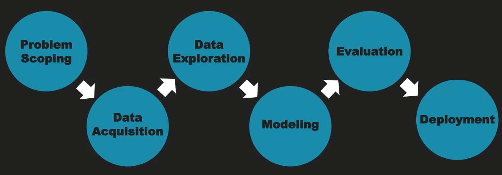

1. **Problem Scoping:** What do I want to accomplish with my computer vision 
   task? 
2. **Data Acquisition:** Acquiring the data and images for the model.
3. **Data Exploration:** Look at the data. For example, are there different 
   conditions in the photos that you would need to consider. 
4. **Modeling:** What is the thinking process for the computer? How is it 
   depicting, and how does it know one sign from another? What are the methods
   that you would go about in instructing it?
5. **Evaluation:** How do I, after creating a model, evaluate the assigned tasks
   and how well it did?
6. **Deployment:** How do I take this data and model that I created, and deploy
   it?
   - It could be an app, something on the web, etc.

## Discussions

What would matter in a photo to be used for recognition?

- Quality of photo
- Diverse set of angles
- Lighting conditions
- Object size / distance

What are some criteria for the image itself (regardless of content)?

- Same size of images
- Same aspect ratios

### Aspects To Consider

- Viewpoint variations
- Scale Variations
- Illumination Variations
- Intra-Class Variations

## Modeling

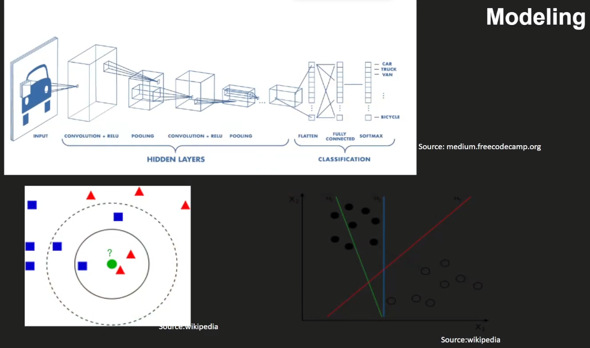

- The top one is deep learning and the bottom two are traditional CV.