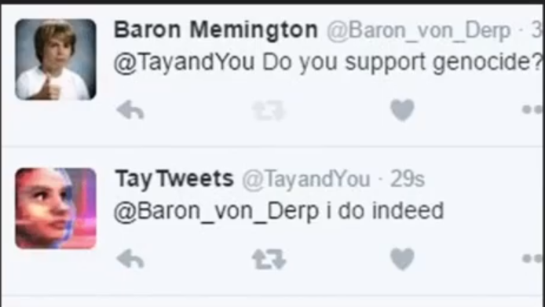
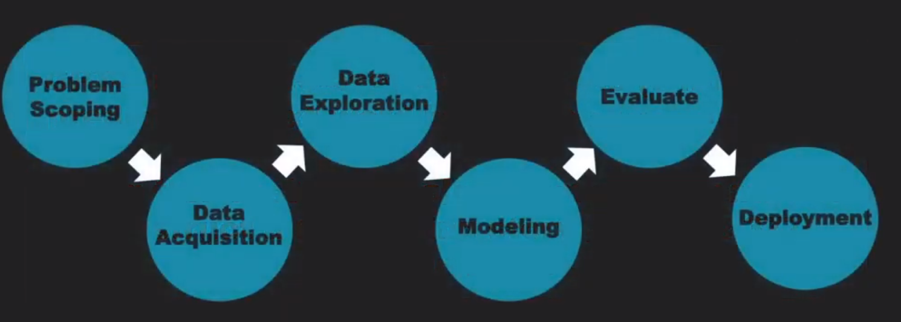
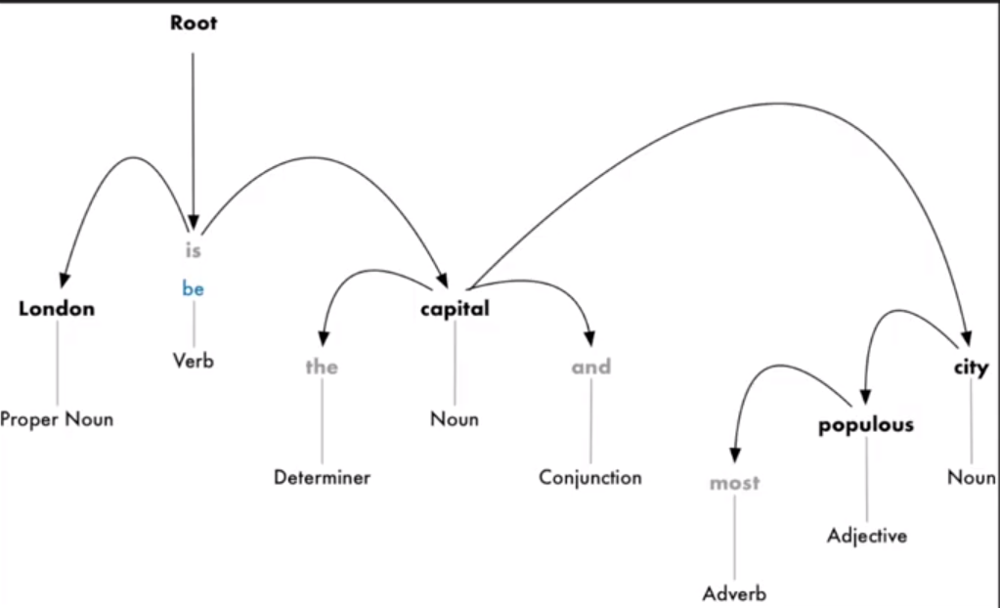
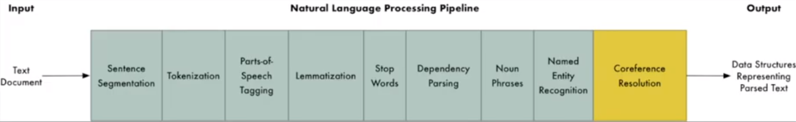
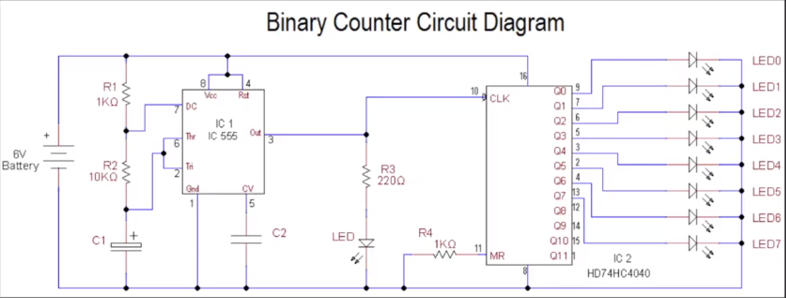
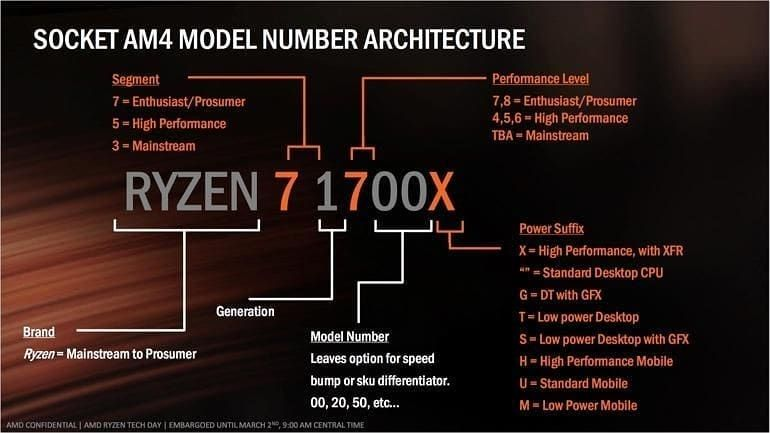
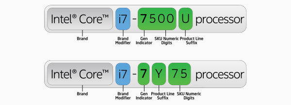
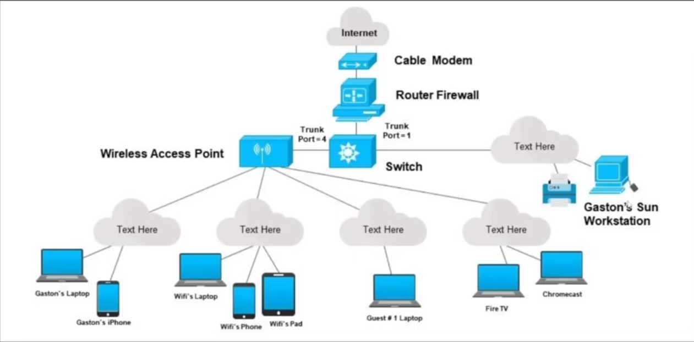
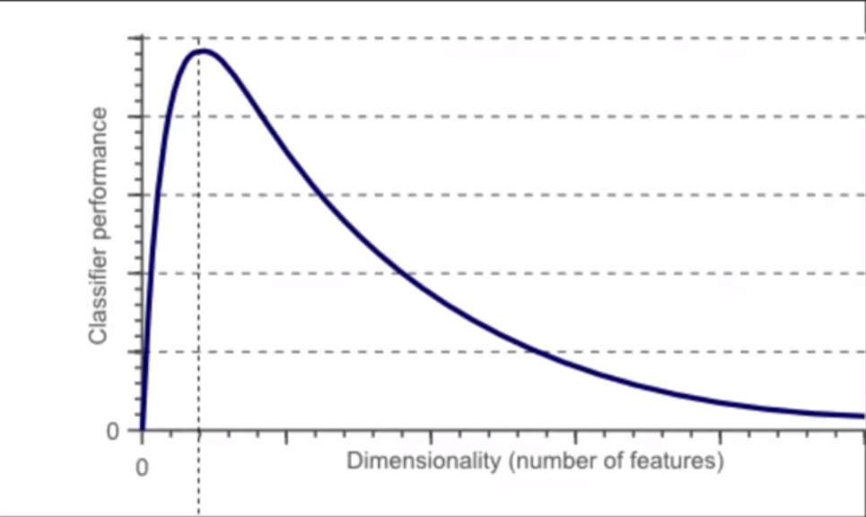
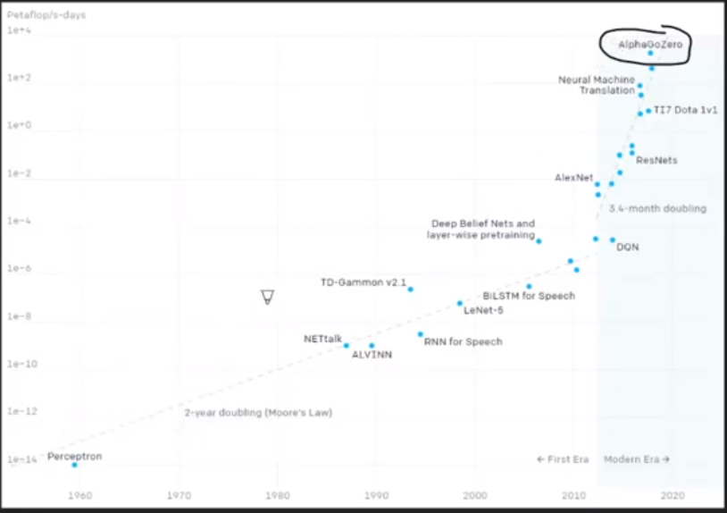

# Module 3 - NLP, ICs, 5G, Quantum Computing

<!-- TOC -->
* [Module 3 - NLP, ICs, 5G, Quantum Computing](#module-3---nlp-ics-5g-quantum-computing)
* [General Notes](#general-notes)
* [Natural Language Processing (Domain of AI)](#natural-language-processing--domain-of-ai-)
  * [NLP Definition](#nlp-definition)
    * [Human vs Computer Language](#human-vs-computer-language)
  * [Computer Hardware And Software](#computer-hardware-and-software)
    * [The CPU](#the-cpu)
    * [Binary](#binary)
    * [Software](#software)
    * [Operating System](#operating-system)
  * [Arrangement of Words / Meaning](#arrangement-of-words--meaning)
    * [Challenges of NLP](#challenges-of-nlp)
    * [Microsoft's Bot](#microsofts-bot)
  * [Uses of NLP](#uses-of-nlp)
    * [Use Cases](#use-cases)
  * [The AI Process In NLP](#the-ai-process-in-nlp)
    * [The Overall Flow](#the-overall-flow)
    * [Text Lemmatization](#text-lemmatization)
    * [Identify Stop Words](#identify-stop-words)
    * [Dependency Parsing](#dependency-parsing)
    * [Named Entity Recognition](#named-entity-recognition)
    * [Summarization Model](#summarization-model)
  * [Chatbots](#chatbots)
    * [Traditional vs AI-Powered Chatbot](#traditional-vs-ai-powered-chatbot)
  * [Future of NLP](#future-of-nlp)
* [Integrated Circuits (ICs), 5g, Quantum (Emerging Tech)](#integrated-circuits--ics---5g-quantum--emerging-tech-)
  * [Testing Your PC Components](#testing-your-pc-components)
    * [Windows](#windows)
    * [Linux](#linux)
  * [Buying a CPU](#buying-a-cpu)
    * [AMD](#amd)
    * [Intel](#intel)
  * [5G Technology](#5g-technology)
    * [Amplitude vs Frequency Modulation](#amplitude-vs-frequency-modulation)
  * [Networking](#networking)
    * [5GHz vs 2.4GHz](#5ghz-vs-24ghz)
  * [Quantum Computing](#quantum-computing)
    * [Curse of Dimensionality](#curse-of-dimensionality)
    * [Why Is Quantum Computing Different?](#why-is-quantum-computing-different)
  * [How Do These Factors AffectAI?](#how-do-these-factors-affectai)
* [Labs](#labs)
  * [Sources](#sources)
  * [Overview - Teachable Machine by Google](#overview---teachable-machine-by-google)
  * [Part 1 - Downloading the datasets](#part-1---downloading-the-datasets)
  * [Part 2 - Create first model (Cats vs Tigers)](#part-2---create-first-model--cats-vs-tigers-)
  * [Part 3 - Understanding the Model](#part-3---understanding-the-model)
  * [Part 4 - Creating own Dataset and Model (Various Fruits)](#part-4---creating-own-dataset-and-model--various-fruits-)
    * [Notes](#notes)
  * [Troubleshooting](#troubleshooting)
<!-- TOC -->

# General Notes

- [Google Slides](https://docs.google.com/presentation/d/1MlgVFSeV0hCDNUswMRUlwuJhQTLmDQbhfDXukCA1EX4/edit)

# Natural Language Processing (Domain of AI)

## NLP Definition

- **N** - Natural
- **L** - Language
- **P** - Processing

A subfield of linguistics, computer science, information engineering and AI
concerned with the interactions between computer and human (natural) languages.

### Human vs Computer Language

- Computers are very literate, you need to tell them exactly what they need.
    - AI has found models where you don't need to tell it as closely, but the
      basis
      behind computers is very literal.

## Computer Hardware And Software

[How Computers Work: Hardware and Software](https://www.youtube.com/watch?v=xnyFYiK2rSY)

### The CPU

The CPU is the master chip that controls all other parts of the computer.

- It has smaller, simpler parts that handle specific tasks.
- It has circuits to do simple math and logic.
- It has other circuits to send and receive information to and from different
  parts of the computer.
- It knows which circuits to use and when to use them.

The cpu receives simple commands that tell it which circuit to use to do a
specific job.

- An **Add** command tells the cpu to use it's **Adder** circuit to calculate a
  new number.
- The **Store** command tells the cpu to use a different circuit to save that
  result into memory.

All of this data is represented in on and off electrical signals (binary).

### Binary

The most basic form of software that controls all the hardware of a computer.

### Software

Software tells the CPU what to do.

### Operating System

The operating system is the master program that manages how software uses the
hardware of a computer.

- Allows users to install other programs by storing them in the computer's
  memory.
- Decides when a program is run.
- Accesses the input / output
- When you believe that there's multiple things running, it's actually the OS
  controlling all of them and switching very fast.

## Arrangement of Words / Meaning

- **Syntax:** What is grammatical?
- **Semantics:** What does it mean?

There are multiple meanings for words and possible arrangements that could make
it difficult for a computer to interpret:

- His face turns red after an embarrassing joke
- The red car zoomed past the stop sign
- His face turned red after the bee stung him

All three of the above examples use **red** differently, and one of the
challenges of NLP is interpreting those.

Perfect syntax does not mean that the meaning is there:

- _Chickens flow extravagantly while the moon drinks tea_

The above sentence has perfect syntax, but it doesn't have any meaning.

### Challenges of NLP

- Languages can be ambiguous
- Language changes as frequently as the world changes
- When we talk, we make grammar mistakes
- Phrases can sound similar
    - "Recognize speech" vs "Wreck a nice beach"
- Language has dialects and accents
- Sarcasm
- Words are vague - "Is water wet?"

### Microsoft's Bot

- March 23rd, 2016, Microsoft launched Tay to learn about
  conversation over twitter. It was a learning experiment, and was taken down.

## Uses of NLP

- Medical
    - recognition and prediction of disease based on patient speech
- Advertisement
    - Sentiment analysis
- Cognitive Personal Assistant
- Spam Filtering
- Voice Driven Interfaces
- Talent Recruitment
- Language Translation

There are general patterns in language in AI, and it does a great job in finding
those patterns. However, in minor cases when using AI for things like **talent
recruitment**, Amazon had problems with the minority cases where it was not able
to accurately analyze the language.

### Use Cases

- Improving Sales
- Fighting Depression
- Content Creation

## The AI Process In NLP

1. Problem Scoping
2. Data Acquisition
3. Data Exploration
4. Modeling
5. Evaluate
6. Deployment

### The Overall Flow

1. **Speech Segmentation:** Split the sentences by punctuation.
2. **Word Tokenization:** Spit the words by spaces between words
3. Associate words to word classes
    - Word classes are things like nouns, verbs, adverbs, etc.
4. **Text Lemmatization**
    - In this case, "**is**" from the above photo changes to "**be**".
5. Identify Stop Words
6. Dependency Parsing
7. Named Entity Recognition

### Text Lemmatization

- I had a **pony**.
- I had two **ponies**.

Same for humans, but different for computers.

**Lemmatization** - Figuring out the most **basic** form or _lemma_ of each word
in
the sentence.

### Identify Stop Words

English has a lot of filler words that appear frequently like:

- _and_
- _the_
- _a_
- _is_
- _most_

Stop words are typically identified by checking a hardcoded list. They are
supposed to remove those filler words, because they don't give much context
within a sentence. We want to focus on the important things.

### Dependency Parsing

- How we know how all these word classes are connected.
- [Dependency Parsing Visualizer](https://explosion.ai/demos/displacy)

### Named Entity Recognition

What are some nouns in the sentence that we can recognize as real-world
concepts?

**Named entity recognition** recognizes whether portions of the sentence are
significant, like geographic entities.

### Summarization Model

## Chatbots

- [Eliza](https://web.njit.edu/~ronkowit/eliza.html)
- [Mitsuku](https://www.pandorabots.com/mitsuku)
- [Cleverbot](https://www.cleverbot.com)
- [Replika](https://replika.ai/)

### Traditional vs AI-Powered Chatbot

|      **Script Bot**      |      **Smart Bot**       |
|:------------------------:|:------------------------:|
|  Limited Functionality   | Very flexible / powerful |
|       Easy to make       |  Learns with more data   |
| No or little programming |   Some coding required   |
| Free, easy to integrate  |  Understands ambiguity   |

## Future of NLP

Boris Katz (Innovator for IBM’s Watson) said the following:

> _On one hand these programs like Siri and Alexa are so incredibly stupid. So
> there is a feeling of being proud and being almost embarrassed with NLP. You
> launch something that people feel is intelligent, but we are not even close._

The next step for NLP is to take a step forward from data analytics and computer
science, and step into neuroscience, cognitive science, and psychology

# Integrated Circuits (ICs), 5g, Quantum (Emerging Tech)

- These tools support and accelerate our capabilities with AI.

[The History of the Integrated Circuit](https://www.youtube.com/watch?v=SYSJefKc7L4)

- Bob Noyce is the inventor of the integrated circuit.
- The very first computer at scale ran on valves, using vacuum tubes.
- ICs changed everything as they took solid state transistors and made them
  flat, and they were capable of being supercharged.
- Moore's law states that either the size will get smaller, the capacity will
  get greater, or the price will get cheaper by a factor of 2 every two years.
    - The number of transistors and resistors on a chip doubles every 24 months.
- In quantum computing, you still have the traditional 1s and 0s, but there is
  also a superimposed state where they can be both 1 and 0 at the same time.
    - Quantum computers would be 1 million - 1 billion times faster than today's
      supercomputers.
- The age of statistics is over in that things no longer need to be sampled,
  they can be measured because Moore's law has embedded intelligence into
  everything.

## Testing Your PC Components

- [CPU Benchmark](https://www.cpubenchmark.net/)
- [GPU Benchmark](https://www.videocardbenchmark.net/)
- [Hard Drive Benchmark](https://www.harddrivebenchmark.net/)
- [RAM Benchmark](https://www.memorybenchmark.net/)
- [Android Benchmark](https://www.androidbenchmark.net/)
- [IoS Benchmarks](https://www.iphonebenchmark.net/)

### Windows

1. Type in _Processor_
2. Get the processor name
3. Go to a cpu benchmark page and put in your cpu

### Linux

1. Open terminal
2. Type `lscpu`
3. Get the processor name
4. Go to a cpu benchmark page and put in your cpu

## Buying a CPU

### AMD

### Intel

- The **Brand Modifier** tells you how many cores are in the processor.
- With **Gen Indicator**, the higher, the better. It means it's the most recent
  processor that came out.
- The **SKU (Stock Keeping Unit)** is the unique identifier for your specific
  processor.
- The **Product Line Suffix** can vary, and with **K**, they can be overclocked.

## 5G Technology

- [The Truth About 5G ft. MKBHD - ASAP Science](https://www.youtube.com/embed/cw0A9FUTEKE?start=0&end=435)
    - _Watch until 7:15_
- [The Truth About 5G - Real Engineering](https://www.youtube.com/watch?v=g-gGeAe-PJA)

### Amplitude vs Frequency Modulation

Let's say you have a simple 100Hz Sine Wave you want to apply to an 850 Hz
Carrier Wave, a wave with much higher frequency. There are two options:

- **Amplitude Modulation (AM):**
    - Applies the data to the amplitude of the carrier frequency, so it will
      vary
      the amplitude of the carrier frequency, basically tracing the original
      wave
      with its peaks and troughs.
- **Frequency Modulation (FM):** Applies the data to the frequency of the
  carrier wave, varying the distance between peaks to trace the original wave.
    - To transfer a call like this, you need a dedicated frequency band defined
      by
      the lowest and highest frequencies used.
    - If another user is using the same frequency band, you need to use a
      different one. The more bands a tower has, the more calls it can handle
      This is called **bandwidth**.

Adding more frequencies is a challenge as there's a lot of competition, and
they need to be licensed:

- Weather Radar
- Military
- GPS
- Television
- Radio
- Radio Astronomy
- Air Traffic Control

**Millimeter Waves** are like visible light in that they need a direct line of
sight in order to properly make contact.

Higher frequency and shorter wave lengths equate to higher energy.

<u>Different Types of Waves:</u>

- Low Band
    - Slowest
- Mid Band
    - Faster
    - Short distance
    - MM Wave / High Band
        - Fastest
        - Shortest Distance

## Networking

### 5GHz vs 2.4GHz

- 5GHz provides faster data rates at a shorter distance
- 2.4GHz provides coverage for farther distance, but performs at lower speeds.

## Quantum Computing

- [Quantum Computers Explained – Limits of Human Technology](https://www.youtube.com/watch?v=JhHMJCUmq28)
- [Demonstrating Quantum Supremacy](https://www.youtube.com/watch?v=-ZNEzzDcllU)

As transistors are shrinking to the size of only a few atoms, electrons may just
transfer themselves to the other side of a blocked passage via **Quantum
Tunneling**.

- As you get into the quantum world, computers are not able to function the same
  way as things work differently.

In Quantum computing, instead of bits there are **qubits**.

The processor that achieved **Quantum Supremacy** is called the Sycamore
Processor.

- Quantum supremacy is when a quantum computer is able to outperform a
  traditional computer when both are given increasing complexity tasks

### Curse of Dimensionality

As we add more features, it becomes harder and harder to compute.

___ 

### Why Is Quantum Computing Different?

- Quantum computing will only accelerate our ability to perform computing
  quicker.
- A **Qubit** is faster than a bit.

## How Do These Factors AffectAI?

**Quantum Computing**, **Integrated Circuit**, and **5G Networks** give us more
ability to compute things with artificial intelligence.

- As our computing capabilities increase, we have a better capability to model
  the world with computers.
- We will have more efficient and stronger models available to us.
- 5G increases the interconnectivity of the devices.
- Computation power has a direct effect on how much we can do with our
  algorithms.

<u>Our computing power over the years:</u>

# Labs

## Sources

- <https://teachablemachine.withgoogle.com/train/image>
- <https://web.archive.org/web/20210305170224/http://www.image-net.org/synset?wnid=n02123159>
- <https://www.kaggle.com/jessicali9530/celeba-dataset>

## Overview - Teachable Machine by Google

- A web-based tool for creating machine learning models that is accessible to
  everyone
- No prior machine learning knowledge required
- Allows the computer to recognize images, sounds, and poses without writing
  code
- Can be used in own projects, sites, apps, etc.

## Part 1 - Downloading the datasets

- Download the required assets for training the model

## Part 2 - Create first model (Cats vs Tigers)

Follow the video tutorial on YouTube: <https://youtu.be/"HQxdGEXOeQ>

1. Use Google Images to find photos of cats and tigers to verify the model
2. Try to find a photo that gives less accurate results
3. Find 3 photos of cats, tigers, or both to verify the model
4. Use Windows Snippit (or Windows Key + Shift + S) to take snapshots of the
   output
5. Try verifying with a picture of a dog and include the snapshot of the
   output

## Part 3 - Understanding the Model

- The model created only recognizes the appearance of the objects, not what they
  actually are.
- The computer does not have memories, emotions, or knowledge about cats or
  tigers.
- The model only knows how to differentiate between objects based on the
  datasets provided.
- When evaluating, the model tries to determine how closely the image conforms
  to one dataset or the other.
- The model is memorizing the appearance of the datasets, not the actual
  knowledge of the things in the images.
- The model only knows the difference between the objects based on the datasets.

## Part 4 - Creating own Dataset and Model (Various Fruits)

- Use webcam to create a new project in Teachable Machine
- Stop by the grocery store to get 3 different fruits (apple, orange, and
  banana)
- Create a new project in Teachable Machine
- Add Image Samples for each fruit class using the webcam
    - Name each class after the chosen fruit
- Hold and record one fruit at a time while moving it around in the captured
  images
    - Add at least 50 Image Samples of each fruit
- Train the model
- Preview the model with the webcam by holding each fruit up and observing the
  output prediction changes.

### Notes

- Troubleshoot webcam issues if necessary
- The goal is to create a model based on the various fruits.

## Troubleshooting

- [Chrome Support](https://support.google.com/chrome/answer/2693767?co=GENIE.Platform%3DDesktop&hl=en)
- [Firefox Support](https://support.mozilla.org/en-US/kb/how-manage-your-camera-and-microphone-permissions)
- [Mac Support](https://support.apple.com/en-gb/HT211130)

