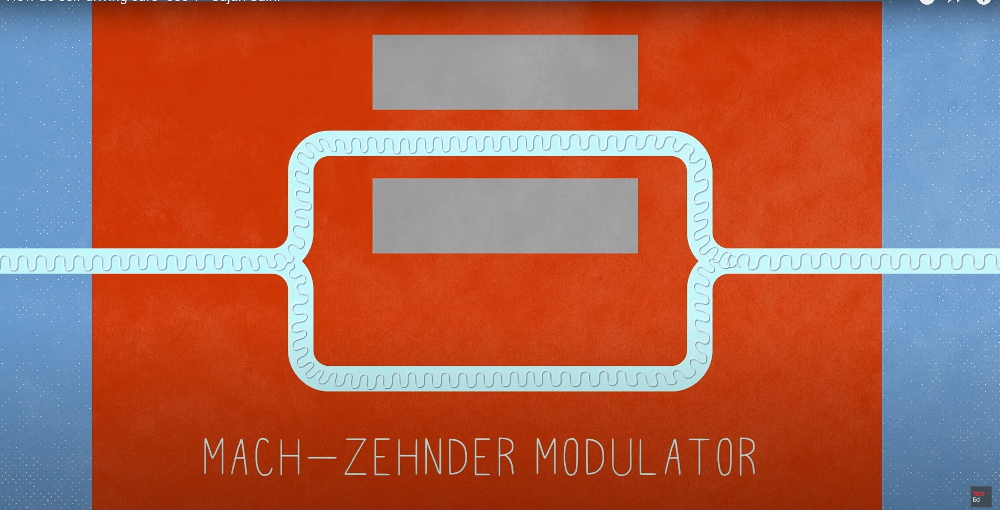
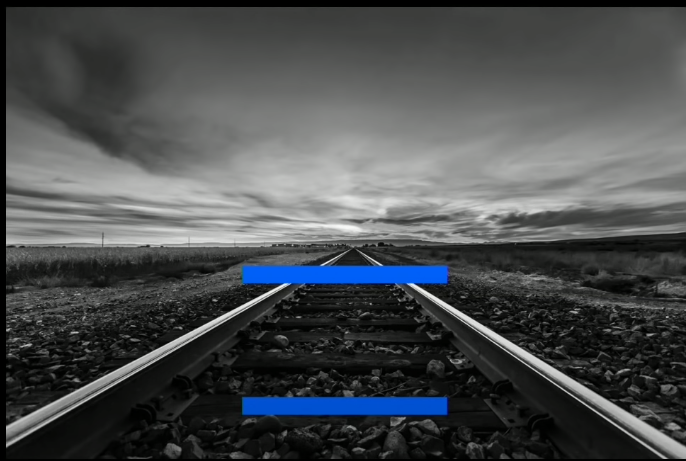
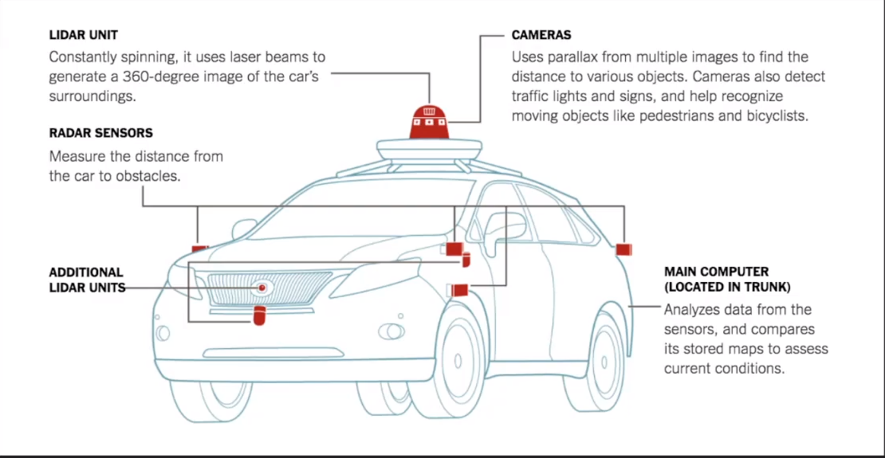
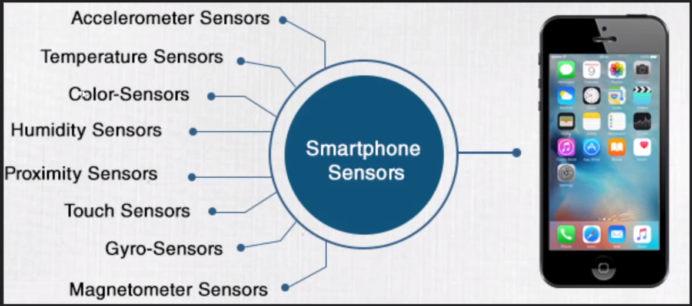
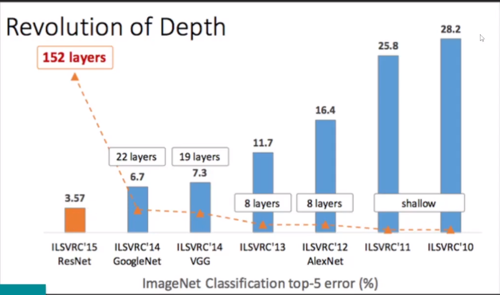

# Module 4 - Autonomous Vehicles, IoT

<!-- TOC -->
* [Module 4 - Autonomous Vehicles, IoT](#module-4---autonomous-vehicles-iot)
* [General Notes](#general-notes)
  * [Autonomous Vehicles](#autonomous-vehicles)
    * [LiDAR](#lidar)
      * [Photonics](#photonics)
    * [LiDAR vs Cameras](#lidar-vs-cameras)
    * [What's Inside a Self-Driving Car?](#whats-inside-a-self-driving-car)
  * [Levels of Automation](#levels-of-automation)
  * [Top Autonomous Car Companies Now](#top-autonomous-car-companies-now)
  * [Current Issues With Consumer Self-Driving Cars](#current-issues-with-consumer-self-driving-cars)
  * [Morality](#morality)
  * [Further Study](#further-study)
* [Internet of Things](#internet-of-things)
  * [Sensor Data](#sensor-data)
  * [Learning Algorithms](#learning-algorithms)
<!-- TOC -->

# General Notes

- [Google Slides](https://docs.google.com/presentation/d/1cLh31WUVlJwBLf2-SgHaIT-sY0O0qTu_MmVMv7jTKiA/edit#slide=id.gdaaba7bf76_2_75)

## Autonomous Vehicles

- [How do self-driving cars “see”? - Sajan Saini](https://www.youtube.com/watch?v=PRg5RNU_JLk)
- [Elon Musk on Cameras vs LiDAR for Self Driving and Autonomous Cars](https://www.youtube.com/watch?v=HM23sjhtk4Q)

### LiDAR

In Aviation, **Radar** antennas launch pulses of radio or microwaves at planes
to learn their locations by timing how long the beams take to bounce back.

- This is limited in that it cannot see fine details

**LiDAR** is a special laser-based probe and is used with integrated photonics
(a miniature version of the communications technology that keeps the internet
humming.)

- LiDAR stands for **Li**ght **D**etection **A**nd **R**anging

LiDAR uses a narrow invisible infrared laser and can image features as small as
the button on a pedestrian's shirt across the street.

To get depth resolution, LiDAR fires a train of super short laser pulses to give
depth resolution.

#### Photonics

Rather than switching a laser on and off (which would make a laser unstable and
affect the precise timing of its pulses, limiting depth resolution), it's better
to leave it on and block and use something else to reliably block the light
periodically and rapidly.

- The digital data of the internet is carried precision-timed pulses of light,
  some as short as 100 picoseconds.
- A **Mach-Zehnder Modulator** is one way of creating these pulses.
    - uses **Interference**, splitting waves of light along two parallel arms
      and
      rejoining them.
    - the light is slowed down and delayed in one arm, the waves recombine out
      of
      sync and cancel, blocking the light.
        - Toggling this delay acts like an on/off switch

A light pulse lasting a hundred picoseconds leads to a depth resolution of a few
centimeters. By pairing it with a super-sensitive, fast-acting light detector,
the depth resolution can be refined to a millimeter.

The spinning assemblies on top of self-driving cars is an assembly using
integrated photonics with a modulator and a detector.

Modulators and detectors are being shrunk to less than a tenth of a millimeter
and packed into tiny chips that will one day fit inside the light of a car.

- These modulators have a variation on the modulator that will only slow the
  light in the modulator a tiny bit, acting as a dimmer rather than an on/off
  switch.
    - An array of many such modulators allows for the creation of a steerable
      laser beam.

### LiDAR vs Cameras

There are multiple ways to get depth perception:

1. Depth from multiple views (stereo)
    - Humans and animals with eyes in the front use this method
2. Depth from motion
    - Animals with eyes on the side of their heads get structure from motion.
        - They will bob their heads and get multiple views from the world to
          triangulate depth.
3. Monocular depth cues from single image alone
    - 

LiDAR should be used where it makes sense. In cars, you want to use something
that is not a visible wavelength. Passive optical takes care of all visible
wavelengths, so pairing this up with a wavelength that is occlusion (fog, snow,
dust, etc.) penetrating like radar.

### What's Inside a Self-Driving Car?

- You don't want the system to be online, so the computer is stored on the car
  itself. It needs to be as localized as possible.
- The cars use **bounding boxes**.

## Levels of Automation

- **Level 0 - No Automation:** Human controls everything
- **Level 1 - Driver Assistance:** Provides help with steering or accelerating.
  - _Example: Cruise Control_
- **Level 2 - Partial Automation:** Controls steering and accelerating with
  human assistance.
  - _Example: Tesla's Autopilot_
- **Level 3 - Conditional Automation:** Will control and monitor environment,
  can ask for human assistance.
  - _Example: Audi A8's Traffic Jam Pilot_
- **Level 4 - High Automation:** Autonomous car can handle most situations, may
  ask for help.
- **Level 5 - Full Automation:** Truly self-sufficient car. No human
  intervention.
  - _Example: Google Waymo_

## Top Autonomous Car Companies Now

- Lyft
- Uber
- Waymo (Google)
- Tesla
- General Motors

## Current Issues With Consumer Self-Driving Cars

- **Lidar** - Too expensive, $75k a piece.
- **AI** - Not smart enough for critical situations yet.
- **Mapping** - More data, so the car can focus on AI related.
- **Infrastructure** - It needs to stop blocking its sensors, remove signs
- **Human Trust** - Not reliable enough to trust with a human life.

## Morality

[Moral Machine](https://www.moralmachine.net)

- Decide on several moral situations, and then see how the rest of the world
  answered.

## Further Study

- **SLAM** Algorithm
  - **S**imultaneous **L**ocalization **a**nd **M**apping Algorithm
  - <https://www.youtube.com/watch?v=SeNLUW79_-c>
- Kalman Filters
- Markov Localization
- Deep Reinforcement Learning
- Computer Vision

# Internet of Things

[Internet of Things (IoT) | What is IoT | How it Works | IoT Explained | Edureka](https://www.youtube.com/watch?v=LlhmzVL5bm8)

- IoT is a giant network with connected devices that gather and share data about
  how they're used and the environment in which they operate.
  - This is done with sensors.

The Internet of Things describes physical objects that are embedded with
sensors, processing ability, software, and other technologies that connect and
exchange data.

- _Ring doorbells_
- _Smart fridges and smart washing machines_
- _etc._

## Sensor Data

## Learning Algorithms

- Deep-learning requires a lot of data to improve.

Over time, we have created larger models that work with more data. This is
called **Revolution of Depth**:

