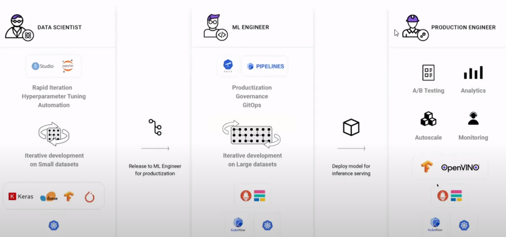
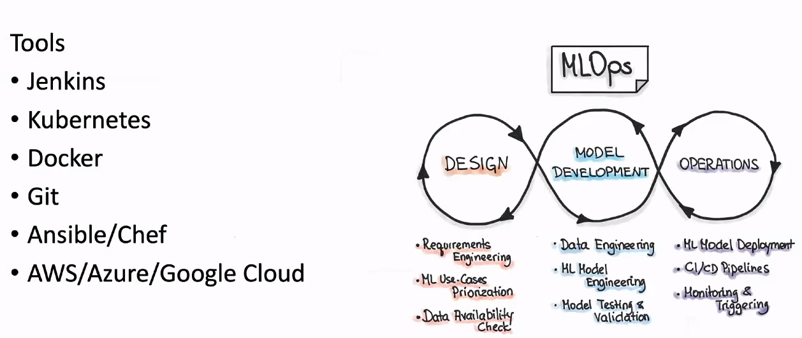

# Module 5 - Systems Thinking

<!-- TOC -->
* [Module 5 - Systems Thinking](#module-5---systems-thinking)
* [General Notes](#general-notes)
* [Basics of Systems Maps](#basics-of-systems-maps)
  * [Principles of Systems Thinking](#principles-of-systems-thinking)
    * [Interconnectedness](#interconnectedness)
      * [Example of Circular Mindset](#example-of-circular-mindset)
    * [Synthesis](#synthesis)
    * [Emergence](#emergence)
    * [Feedback Loops](#feedback-loops)
    * [Causality](#causality)
  * [Further Reading](#further-reading)
* [AI Industry Guest Speaker](#ai-industry-guest-speaker)
  * [General Notes](#general-notes-1)
  * [Industrial AI](#industrial-ai)
    * [Types of Machine Learning Jobs](#types-of-machine-learning-jobs)
    * [MLOps Engineer](#mlops-engineer)
    * [Data Engineer](#data-engineer)
      * [Role](#role)
      * [Tools](#tools)
* [Lab - Audio Classifier](#lab---audio-classifier)
  * [Sources](#sources)
  * [Creating The Sample Data](#creating-the-sample-data)
  * [Understanding The Model](#understanding-the-model)
<!-- TOC -->

# General Notes

- [Loopy](https://ncase.me/loopy/)

# Basics of Systems Maps

**Elements** are multiple factors affecting an issue.

- In a systems map, all elements are connected by relationships represented by
  the arrowhead lines.
- Loops indicate the direction and degree of feedback.
- Outcome changes when the elements or relationships are changed.

There are two types of relationships:

- **Positive** represented by a **+**
    - An increase in the input leads to an increase in the output
- **Negative** represented by a **-**
    - An increase in the input leads to a decrease in the output

## Principles of Systems Thinking

### Interconnectedness

**Interconnectedness:** Shifting a mindset from linear to circular.

- Seeing the connections between things rather than the immediate result.

#### Example of Circular Mindset

Your algorithm is not producing the results you were expecting.

- **Linear:** You try to change the test case to get the results you want
- **Circular:** You try to see if there is issues with your algorithm
  architecture or data inputted to see if that is why you are getting error in
  results

### Synthesis

**Synthesis:** Dissection of complexity into manageable components.

### Emergence

**Emergence:** The outcome of the synergies of the parts.

- After splitting the problem into parts and decide on the best solution, you
  evaluate what emerges from your solution and understand why it came to be.

### Feedback Loops

**Feedback Loops:** How your elements increase or decrease to either create more
/ less of itself or to balance between other elements.

- **Reinforcing Feedback:** Reinforce more of the same element in a system.
  - _Ex. Population Growth_
- **Balancing Feedback:** Balance between the elements in a system is to not
  have ove abundance of one.
  - _Ex. Predator / Prey_

### Causality

**Causality:** How one change results in an overall change of the state of the
dynamic and evolving system.

- Cause and effect
- AI systems now use statistical models rather than strictly cause and effect.

--- 

## Further Reading

- Thinking in Systems by Donella Meadows: <https://wtf.tw/ref/meadows.pdf>
- Loopy, a tool for thinking in systems: <https://ncase.me/loopy/>
- Sustainable Development Goals: <https://www.undp.org/content/undp/en/home/sustainable-development-goals.html>

# AI Industry Guest Speaker

[Next Lesson](https://www.youtube.com/watch?v=TWnGMo9ZDd4)

- 

## General Notes

- **Single Board Computers (SBC)** are things like raspberry pi's.
- Intel's Myriad X is a vision accelerator designed to be used with AI.
  - Intel Movidius VPU
- <https://deeplearn.org>
- <https://pyimagesearch.com>

## Industrial AI

Consists of:

- Anomaly Detection
- Quality Control
- Predictive Maintenance
- Process Monitoring

In a typical factory setting, there are 2 - 3 different algorithms (OpenCV, Deep
Learning, etc.) running on a given defect type.

<u>Key Challenges in Industrial AI:</u>

- **Labeled datasets**
- **Small sample size of defects**
  - One thing that people do is synthetically create defects

### Types of Machine Learning Jobs

- Data scientist
  - Comes up with the latest and greatest neural network architectures and 
    computational algorithms
- ML Engineer
  - Productize the model that was created: Web API's, security, model decay, 
    etc.
- Production Engineer
  - The person who is normally on the floor who is the factory operator.

--- 

- If a proprietary algorithm is licensed, you can do things like royalties and
  revenue share models.
- Most of the coding is in the ML Engineer category

### MLOps Engineer

- **DevOps** is the way of combining the code, build, deploy, testing, and
  different buckets into one pipeline.
  - DevOps focuses on automating all of that.
- **MLOps** is an extension of DevOps. They're similar, but there are some key
  differences.
  - More oriented around governance for models and AI
- Jenkins is the CI/CD Pipeline
- Kubernetes and Docker handle containerization
- Git is for versioning
- Ansible/Chef automate bringing up the systems
- AWS/Azure/Google Cloud are CSVs (Cloud Service Providers) for deployment.

### Data Engineer

#### Role

- Process large amounts of data at a scale
- Improve data reliability and quality
- Data acquisition methods

#### Tools

- MongoDB, PostgreSQL
- Spark
- Hadoop

# Lab - Audio Classifier

## Sources

- <https://teachablemachine.withgoogle.com/train/audio>
- <https://medium.com/@warronbebster/teachable-machine-tutorial-snap-clap-whistle-4212fd7f3555>
- [Teachable Machine](https://teachablemachine.withgoogle.com/train)

## Creating The Sample Data

[Youtube Tutorial](https://teachablemachine.withgoogle.com/train)

- The overlap factor should be lower if you're having trouble seeing what it
  classifies it as.

## Understanding The Model

Read [this article](https://www.analyticsvidhya.com/blog/2019/07/learn-build-first-speech-to-text-model-python/)

