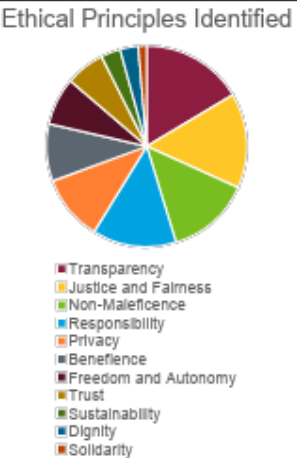
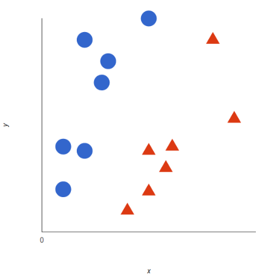
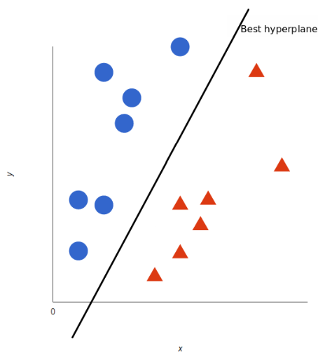
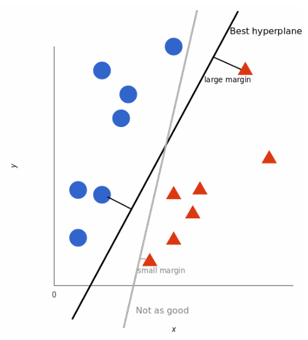
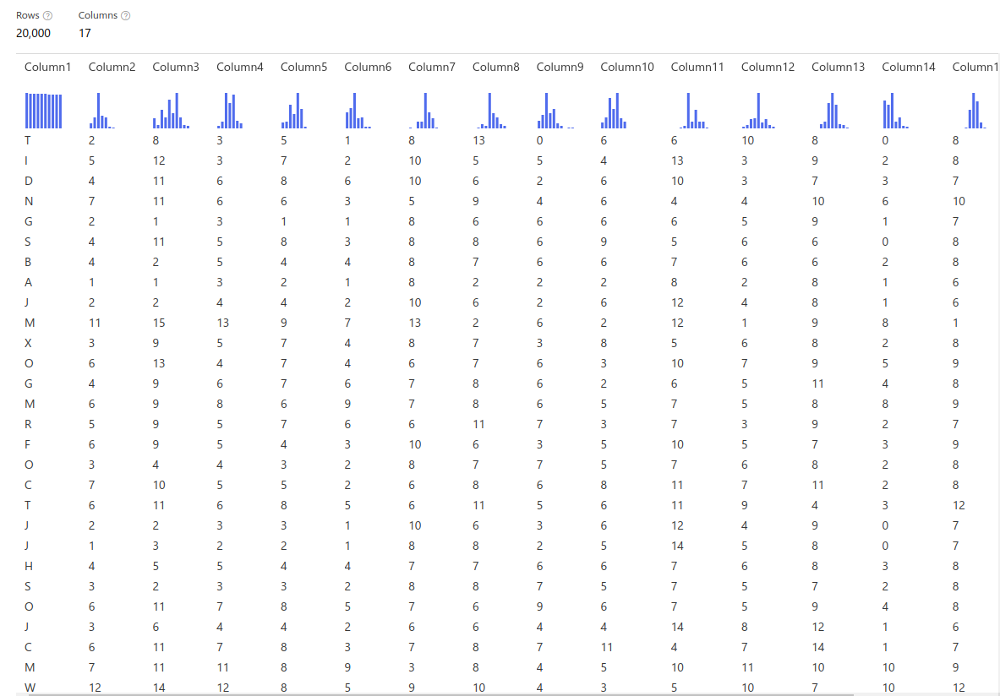
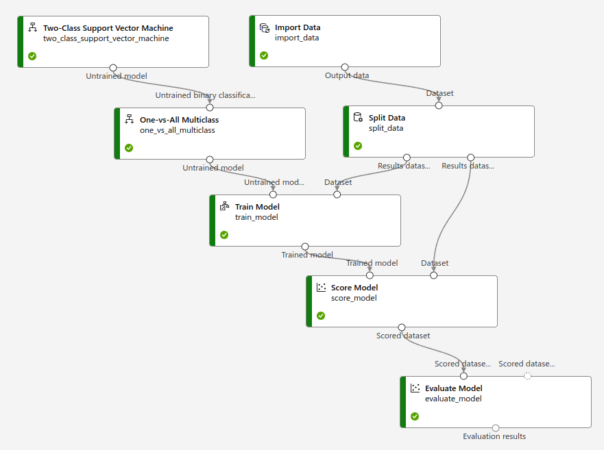

# Module 6 - AI Ethics

# General Notes

- [Google Slides](https://docs.google.com/presentation/d/1K8BnCBCoX5ZLkmHQlLRit-Ahes1oz5aY04K3AHwCyDY/edit?usp=sharing)
- <https://wandb.ai/site/papers>
- **Convolutional Neural Network:** <https://poloclub.github.io/cnn-explainer/>

# Top Fears of AI

1. **AI will produce biased outcomes**
    - An example was an AI that Amazon used for hiring that primarily hired only
      males.
    - This is a valid fear, as people fear that the decisions made will not
      represent the minority.
2. **We have no idea why AI does what it does**
3. **AI will make bad decisions**
    - A question to ask is why wasn't the model tested for the bad decision?
4. **AI will lead to a loss of anonymity**
    - This is true as more and more data is collected, but it has been being
      collected long before AI.
5. **AI will put me out of a job**

## Privacy and Surveillance

- Our data that is being collected can be used for malicious purposes.
- There is also a positive side in that your collected data will provide
  relevant information and services to you.
- We live in a surveillance economy where there are cameras everywhere.
- _The Social Dilemma_ is a good movie to watch that's related to AI ethics.

## Manipulation of Behavior

- Online manipulation and addiction.
    - One example is showing ads to a recovering alcoholic for alcohol. That's
      why
      there's now an option to filter / remove an ad.
- Deep fake text, photos, and video material.
    - Example deep fake video: <https://youtu.be/mUfJOQKdtAk>

## Opacity of AI

- Many AI systems rely on extracting patterns from given data sets, without
  "correct" solutions provided.
- Neither the programmer nor the end-user knows the patterns which the system
  has chosen.
    - How can we make fair decisions without knowing this process, if it's
      superior to humans?
        - I.e. Having to explain in court why this decision was made.

## Bias in Decision Systems

- How do we know if historical data has bias compared to new reformed data?
    - Part of the data engineer's job is to consider this.
    - You don't need historical data for things like autocorrect.
- Data sets can be made to focus on a single matter with no bias, but how do we
  account for the bias if it is used for another matter?

## Human Robot Interaction

- People may not want the human component taken away.
    - An example being sex robots. Do we want humans growing intimate deep
      attachments to objects that cannot have feelings or mean what it says?
        - Example video: <https://youtu.be/dtu4t_Zc3d4>

## Automation and Employment

- Will the creation of new jobs and wealth keep up with the destruction of jobs?
- AI has the potential to further create the gap between high skill / high paid
  jobs and low skilled / low paid service jobs.

## Autonomous Systems

- [The Rise of the Machines – Why Automation is Different this Time](https://youtu.be/WSKi8HfcxEk)
- [How Insurance Will Work With Self-Driving Cars](https://www.thebalance.com/self-driving-cars-and-insurance-what-you-need-to-know-4169822#:~:text=How%20Will%20Insurance%20Work%20With%20Self%2DDriving%20Cars%3F)

Some questions asked against autonomous systems:

- Is the autonomy responsible for its decision-making?
- Is it best to leave our lives to a system that will choose the common defined
  good over pursuing personal interest?
    - Usually an AI engineer in Silicon valley is deciding what the common good
      is.
- Is it best for an autonomous weapon to fight against other autonomous weapons
  to save human interaction in conflict?

## Machine Ethics

[Do Robots Deserve Rights? What if Machines Become Conscious?](https://www.youtube.com/watch?v=DHyUYg8X31c)

**Machine Ethics:** Ethics of machines as subjects, not objects in use.

- **First Law:** Robot may not injure a human being
- **Second Law:** Robot must obey orders given it by human except by conflict of
  first law.
- **Third Law:** Robot must protect its own existence as long as protection does
  not conflict with the first and second law.

## Responsibility for Robots

- Who is responsible, liable, or accountable? The owner or the manufacturer of
  the robot?

## Singularity and Super-intelligence

[What is a Singularity? | Eternally Curious #11](https://www.youtube.com/watch?v=24T58gXCUW8)

- Does AI have the potential to surpass human intelligence and create its own
  systems that also surpass humanity?
- At what point do we define an AI to be super-intelligence and what is our plan
  if such technological advancement occurs?

# Australia Ethics Framework for AI (2019)

- Generates net-benefits > for people
- Do not harm or deceive
- Regulatory and legal compliance
- Privacy protection
- Fairness
  - No discrimination
  - No bias in training data
- Transparency / Explain-ability
  - Explain impact and decision-making
- Contest-ability
  - Challenge use or output
- Accountability
  - Keep creators responsible for outcome

# More Info

- <https://plato.stanford.edu/entries/ethics-ai/>
- <https://www.nature.com/articles/s42256-019-0088-2#Sec15>
- <https://futureoflife.org/ai-policy>

## Resources For Study

- [Turing Institute (UK)](https://www.turing.ac.uk/media/news/alan-turing-institute-data-ethics-group/)
- [AI Now](https://ainowinstitute.org/)
- [Leverhulme Centre for the Future of Intelligence](http://lcfi.ac.uk/)
- [Future of Humanity Institute](https://www.fhi.ox.ac.uk/)
- [Future of Life Institute](https://futureoflife.org/)
- [Stanford Center for Internet and Society](http://cyberlaw.stanford.edu/)
- [Berkman Klein Center](https://cyber.harvard.edu/)
- [Digital Ethics Lab](http://digitalethicslab.oii.ox.ac.uk/)
- [Open Roboethics Institute](http://www.openroboethics.org/)	

# Ethical Principles

# No Ethical AI

The idea that there is no ethical AI: <https://onezero.medium.com/theres-no-such-thing-as-ethical-a-i-38891899261d>

# Lab 4 - Letter Recognition

- Using [Microsoft Azure](https://studio.azureml.net/)

## Support Vector Machines

A **support vector machine (SVM)** is a machine learning model that is used to
classify new data into two separate groups. 

First, we give the model a set of data and what group each point of the data
belongs to (training). The model then tells us what group the new data points
belong to.

Let’s imagine we have two groups: _red_ and _blue_. We will also say that our
data has two features: _x_ and _y_. We want a classifier that given a pair of
_(x,y)_ coordinates, outputs if it’s either _red_ or _blue_.

A support vector machine takes these data points and outputs the hyperplane (for
two dimensions it’s simply a line) that best separates the tags. This line is
called the **decision boundary**.

- In the photo above, the decision boundary is the black line. 
- Any new data point that falls left of the black line will be classified as
  blue. 
- Any new data point falls right of the black line will be classified as red.

To find the best line to draw, there are a couple of ways to create this
calculation but for the example below, it takes the largest margin between the
line and the nearest point of each group to the line.

> _source: <https://monkeylearn.com/blog/introduction-to-support-vector-machines-svm/>_

## Creating the SVM

1. Go to <https://portal.azure.com/#home>
2. Create a new resource group
3. Create a new Azure Machine Learning Workspace
4. Launch the studio by going to the workspace and selecting **Launch Studio**
5. Go to Designer
6. Go to Settings
7. Create a new computer cluster using the cheapest options
   - Wait for it to finish initializing (It will go from blue to green)
8. Drag **Import Data** into the canvas
   1. > Data Input and Ouput -> Import Data 
   2. Change **Data Source** to **URL via HTTP**
   3. Use the following url for the data: <http://archive.ics.uci.edu/ml/machine-learning-databases/letter-recognition/letter-recognition.data>
9. Output **Import Data** to **Split Data** at 0.5 with randomized seed.
10. Drag **Two-Class Support Vector Machine** onto the canvas
    - > Machine Learning Algorithms -> Classification
11. Drag **One-vs-All Multiclass** onto canvas
    - > Machine Learning Algorithms -> Classification
12. Connect output of **Two-Class SVM** to input of **One-vs-All Multiclass**
13. Drag **Train Model** onto the canvas
14. Connect output of **One-vs-All Multiclass** into **Train Model input 1**
15. Connect **output 1** of **Split Data** into **Train Model input 2**
    - For **Train Model** properties, launch the column select and under **With
      Rules**, use **Include -> Column Index** and enter the value **1**.
16. Drag **Score Model** onto the canvas.
17. Connect **Train Model** output into **Score Model input 1**
18. Connect **Split Data output 2** into **Score Model input 2**
19. Drag **Evaluate Model** onto the canvas
20. Connect **Score Model** output into **Evaluate Model input 1**
21. Hit Run and create a **Computer Cluster**

## Understanding The Model

### Import Data Used

Here is a description of the dataset: <https://archive.ics.uci.edu/ml/datasets/Letter+Recognition>

<u>Column Meanings:</u>
1. lettr capital letter (26 values from A to Z)
2. x-box horizontal position of box (integer)
3. y-box vertical position of box (integer)
4. width width of box (integer)
5. high height of box (integer)
6. onpix total # on pixels (integer)
7. x-bar mean x of on pixels in box (integer)
8. y-bar mean y of on pixels in box (integer)
9. x2bar mean x variance (integer)
10. y2bar mean y variance (integer)
11. xybar mean x y correlation (integer)
12. x2ybr mean of x * x * y (integer)
13. xy2br mean of x * y * y (integer)
14. x-ege mean edge count left to right (integer)
15. xegvy correlation of x-ege with y (integer)
16. y-ege mean edge count bottom to top (integer)
17. yegvx correlation of y-ege with x (integer)

**Summary:** The objective is to identify each of a large number of
black-and-white rectangular pixel displays as one of the 26 capital letters in
the English alphabet. 

The character images were based on 20 different fonts and each letter within
these 20 fonts was randomly distorted to produce a file of 20,000 unique
samples. 

The data itself is a CSV (excel file) that has 17 columns in total. The
first column is the capital letter that we describe and the rest of the columns
are statistics that characterize the letter. 

### Two-Class Support Vector Machine and One vs All Mulitclass

There's two classes (or groups) that the support vector machine is drawing a
line (hyperplane) to classify between one or the other on a given data point
(row, column).

---

If you right-click **Import Data -> Preview Data**, you will see the data
pulled.

- _Col 1_ is the letter and ever other column is a value that represents a 
  feature of that letter. 
- The SVM is creating a hyperplane for each of these columns to tell us whether
  it is that specific letter.
- Using the image above, the blue could be data points that **are not T**, while
  the red are data points that **are T**.
- The Support Vector Machine is doing this for every letter.

---

The hyperplane is not a line in a 2-D space, it's actually a _line (or plane)_
in a multidimensional space with each dimension being a column that is in the
data.

- The **Two-Class support Vector Machine** is outputting an estimation of its
  confidence of a letter.
- The **One-vs-All Multiclass** is doing a comparison between the confidence of
  all the letters and choosing the letter with the highest confidence to output.

## Evaluating The Model

Go to **Score Model -> Preview Data**, and scroll to the right to **Scored
Probabilities** section.

- You can see the real letter in _col1_ and the probability assigned to the
  likeliness that the letter is one of the letters in the alphabet.

Go to **Evaluate Model -> Preview Data** to see the overall & average accuracy,
precision, recall, and a confusion matrix that shows on the x-axis the Predicted
Class and on the y-axis the Actual Class.

