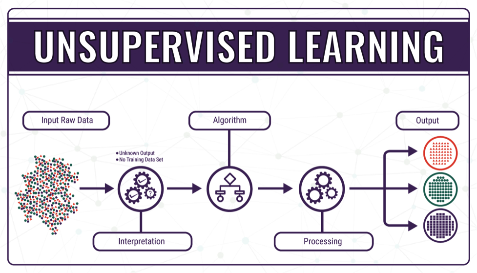
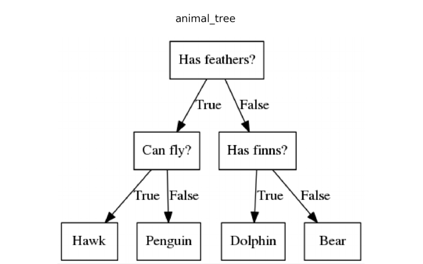

# Module 7 - Intro to ML & Future of Success in AI

<!-- TOC -->
* [Module 7 - Intro to ML & Future of Success in AI](#module-7---intro-to-ml--future-of-success-in-ai)
* [General Notes](#general-notes)
* [Future of Success in AI](#future-of-success-in-ai)
  * [Finding a Job in AI](#finding-a-job-in-ai)
  * [Gaining Experience](#gaining-experience)
  * [Personal Projects](#personal-projects)
  * [Resources for Learning](#resources-for-learning)
  * [Hackathons / Coding Challenges](#hackathons--coding-challenges)
  * [Internships](#internships)
    * [Geting a Machine Learning Internship (YT Video Notes)](#geting-a-machine-learning-internship--yt-video-notes-)
  * [Machine Learning Specializations](#machine-learning-specializations)
  * [Searching For Internships / Jobs](#searching-for-internships--jobs)
  * [Example roles of an AI team](#example-roles-of-an-ai-team)
    * [Getting Started With a Small Team](#getting-started-with-a-small-team)
  * [Shifting Through Job Reqs](#shifting-through-job-reqs)
* [Intro to Machine Learning](#intro-to-machine-learning)
  * [ML Learning Types](#ml-learning-types)
    * [Supervised Learning](#supervised-learning)
    * [Unsupervised Learning](#unsupervised-learning)
    * [Reinforcement Learning](#reinforcement-learning)
    * [Learning Optimization](#learning-optimization)
  * [Measuring Classification](#measuring-classification)
  * [Linear Regression](#linear-regression)
  * [K-Nearest Neighbors](#k-nearest-neighbors)
  * [K-Means Clustering](#k-means-clustering)
  * [Na&Iuml;ve Bayes](#naiumlve-bayes)
  * [Support Vector Machines](#support-vector-machines)
  * [Decision Trees](#decision-trees)
  * [Markov Decision Process](#markov-decision-process)
  * [Logistic Regression](#logistic-regression)
  * [Neural Networks](#neural-networks)
* [Lab 5 - Clustering Iris Flowers](#lab-5---clustering-iris-flowers)
  * [Overview of K-Means Clustering](#overview-of-k-means-clustering)
  * [Creating Our First K-Means Clustering Algorithm](#creating-our-first-k-means-clustering-algorithm)
  * [Understanding The Model](#understanding-the-model)
    * [K-Means Clustering](#k-means-clustering-1)
  * [Evaluating The Model](#evaluating-the-model)
<!-- TOC -->

# General Notes

# Future of Success in AI

## Finding a Job in AI

- AI has only been relevant since 2010
- You should focus on coming in as an Intern

Some problems with graduates coming into the field:

- No solid info on the field
- Few classes offered
- No relevant experience

Some problems for employers in the field:

- Specific use-cases of AI
- Lack of experienced devs

## Gaining Experience

To gain more experience, focus on:

- Personal / School Projects
- Hackathons
- Coding Challenges
  - <https://www.kaggle.com/competitions>
- Open Source Projects
- Internships

## Personal Projects

- Keep the scope small
  - Set a time limit (1 month)
- Keep the code clean, module, and commented
  - Any project can be chosen from your portfolio for review
- Provide a Read Me for dependencies, technology required, tutorials
- Runnable tests to show completeness at ease

## Resources for Learning

- [Standford Machine Learning](https://online.stanford.edu/courses/cs229-machine-learning)
- [Deep Learning.ai by Andrew NG](https://www.deeplearning.ai/)
- [Grokking Deep Learning](https://www.amazon.com/Grokking-Deep-Learning-Andrew-Trask/dp/1617293709)
  - Beginner's guide
- [Deep Learning With Python](https://www.amazon.com/Deep-Learning-Python-Francois-Chollet/dp/1617294438)
- [AI: A Modern Approach](https://www.amazon.com/Artificial-Intelligence-Approach-Stuart-Russell/dp/9332543518/ref=tmm_pap_swatch_0?_encoding=UTF8&qid=&sr=)
  - Very math heavy
- [Coursera: Supervised Machine Learning: Regression and Classification](https://www.coursera.org/learn/machine-learning)

## Hackathons / Coding Challenges

- [Meetup](https://www.meetup.com)
  - [Meetups for Artificial Intelligence](https://www.meetup.com/find/?keywords=ai&source=EVENTS&distance=fiftyMiles)
- ASU Planned Events
- CGCC Events
- <https://www.hackerrank.com>
- <https://www.kaggle.com>
- <https://gym.openai.com>
- <https://www.codingame.com/start>
  - Learn coding by playing a game

## Internships

- Career Fairs
- Become friends with the Professors
- LinkedIn
- Showing up to in-person programming events
* Be willing to do little things to show devotion to your long term goals
  * Showing up to meetups consistently

### Geting a Machine Learning Internship (YT Video Notes)

YouTube video: [How To Get a Machine Learning Internship](https://www.youtube.com/watch?v=GFUc1_uqxCI)

- You will have a better advantage over other candidates without a machine learning
  internship.
- Apply to as many internships as possible
  - **Do not do this for full-time positions**
- Show contributions to open source projects
   - Github
   - Gitlab
   - Sourceforge
- Show participation in machine learning/data science competitions
  - Kaggle
  - DrivenData
- Things to Include in Your Resume
  1. Display a solid understanding of machine learning fundamentals
      - Certificate from something like Coursera
     - Showcase projects on your GitHub involving:
        - Time Series Forecasting
        - Computer Vision
        - Natural Language Processing
  2. Show that you are familiar with deep learning libraries
     - Tensorflow
     - Keras
     - Pytorch
     - Etc.

## Machine Learning Specializations

## Searching For Internships / Jobs

- [Google Jobs](https://careers.google.com/)
- [Indeed](https://www.indeed.com/)
- [Glassdoor](https://www.glassdoor.com/member/home/index.htm)
- [Monster](https://www.monster.com/)

## Example roles of an AI team

> <https://www.coursera.org/lecture/ai-for-everyone/example-roles-of-an-ai-team-FlPw6>

- **Software Engineer**
  - E.g., ensure self-driving reliability
- **Machine Learning Engineer**
  - Might write the software responsible for the **A &rarr; B** mapping.
  - May write other machine learning algorithms for your product
- **Machine Learning Researcher**
  - Extend state-of-the-art in ML
- **Applied ML Scientist**
  - In-between the machine learning engineer and machine learning researcher
- **Data Scientist**
  - Not very well-defined and the meaning is still evolving.
  - Examine data and provide insights
  - Make presentation to team/executive
  - Some data scientists are doing work similar to a machine learning engineer
- **Data Engineer**
  - Organize Data
  - Make sure that data is saved in an easily accessible, secure and 
    cost-effective way.
- **AI Product Manager**
  - Help decide what to build; what's feasible and valuable

### Getting Started With a Small Team

What you would need:

- 1 Software Engineer, or
- 1 Machine Learning Engineer / Data Scientist, or
- Nobody but yourself

## Shifting Through Job Reqs

- If you're interested in AI only, you need to make sure that the job reqs
  are related to what you want.
- Decide if you want to work for a large corporation.
  - They're harder to get into
  - There's more structure to the job spec
  - Dive more into specification
    - Such as anomaly detection
  - Lots of networking / resources
  - Looks good on a resume
- Decide if you want to work for a smaller corporation.
  - Less competition to get into
  - Open-ended projects
    - More of a say in the projects and the end-design
  - Broad specification
    - You may have to do much of the work and mix together different skills,
      such as software engineering and machine learning engineer.
  - Mix between AI / Needed ToDos
  - Smaller network
  - Great for initial experience

# Intro to Machine Learning

## ML Learning Types

### Supervised Learning

Given a set of independent variables which helps us analyze the dependent
variable and the relation between them.

- It learns from previous experiences _(raw data)_.
- The most popular machine learning type.
- Linear regression & support vector machines are examples of supervised 
  learning.

### Unsupervised Learning

- A collection of variables that we try to find out the similarity between them.
- We're really looking for patterns between certain groupings in large data.
  - An example is user preferences in Spotify used as input data, trying to find
    a connection between song genres that they may like.
- Patterns are not being learned from input data, patterns are being identified
  between groups of data.

### Reinforcement Learning

The machine performs actions and looks at the results. Based on the results, it
learns then repeats until it understands.

- The **agent** is like a video game character with a list of possible actions
  that it can take, and knows the state of the environment that it's in.
  - We give a strategy _(called a **policy**)_ where we want it to learn, 
    based on experience, how to go about beating the game. We provide the risks
    and rewards, and then it comes up with a  way to beat the game.

### Learning Optimization

- **Under-fitting**
  - Not accurate enough model to be useful in problem statement
- **Over-fitting**
  - Takes too long to process to be useful in real world scenarios
  - There are mistakes in the real world, and this function doesn't accommodate
    for that.

## Measuring Classification

Accuracy is not the only way to determine if the model is accurate

- _Example: Terrorists identified on flights_
  - 99% of the time you may detect it, but that 1% is very dangerous.

* **Recall:** Expresses ability to find all relevant instances in dataset 
* **Precision:** Proportion of the data our model says was relevant that were
actually relevant.

## Linear Regression

- Supervised Learning
- Finds a linear function that attempts to predict the dependent variable as a
  function of the independent variable.

## K-Nearest Neighbors

- Supervised Learning
- KNN is a model that classifies data points based on the points that are most
  similar to it. 
- It uses training data to make an _educated guess_ on what an unclassified 
  point should be classified as.
- Can be used for:
  - Detecting cancer in pictures
  - The price of a car coming into a lot
  - Etc.

## K-Means Clustering

- Unsupervised Learning
- Group data into classifications based on no prior labeling, just the
  similarity.
- Can be used for:
  - Song recommendations
  - Determining if an email is spam
  - Etc.

## Na&Iuml;ve Bayes

- Supervised Learning
- Classification technique that assumes that a particular feature is independent
  to the presence of any other feature.
- Mostly used for:
  - Text data
  - Spam filtering
  - Etc.

The players will play is the weather is sunny. Is this correct?

## Support Vector Machines

- Supervised Learning
- Classification technique that creates a decision boundary to separate 
  different classes and maximize the margin.

## Decision Trees

- Supervised Learning
- Regression/Classification technique that is essentially a combination of
  if-else statements.

## Markov Decision Process

- Reinforcement Learning
- Planning technique that follows the **Markov Property**.
- **Markov Property:** The future is independent of the past given the 
  present.

- An idea of how a robot could make decisions
- Each **P** Is a probability that it will do that action.

## Logistic Regression

- Supervised Learning
- Classifies between observations to a discrete set of classes.
  - **0** or **1**

- Used often with probabilities

## Neural Networks

- Supervised Learning
- Modeled after the human brain to be a universal function approximator.

- Deep learning can abstract statistical learning in machine learning, making it
  universal.

# Lab 5 - Clustering Iris Flowers

Sources:

- <https://studio.azureml.net/>
- <https://archive.ics.uci.edu/ml/datasets/iris>

## Overview of K-Means Clustering

> <https://towardsdatascience.com/k-means-clustering-for-beginners-ea2256154109>

- K-Means Clustering is considered an unsupervised learning algorithm. 
- Unlike previous algorithms where we gave the program labeled data, an
  unsupervised algorithm does not need labels. 
  - This means that the algorithm must discover the hidden patterns in the data 
    on its own. 
- Clustering means we want to take a dataset with several data points and assign
  them to a group with similar datapoints. 
  - An example is of that is below where data points are clustered into three 
    different groups.

- One practical example would be to cluster crime localities to automate insight 
  into crime-prone areas.

**There are two assumptions behind K-Means:**

1. The center of each cluster is the mean of all the data points that belong
   to the cluster.
2. Each data point belongs to the cluster with the nearest center point.

The steps of the algorithm are as follows:

1. Initialize a cluster by randomly picking points from the dataset and using
   these as starting values.
2. Assign each point to the nearest cluster.
3. Compute the mean of each cluster as the mean for all points that belong to 
   it.
4. Repeat steps **2** and **3** until no point changes cluster.

## Creating Our First K-Means Clustering Algorithm

1. Go to [Microsoft Azure](https://studio.azureml.net/)
2. Create a new experiment
3. Drag **Import Data** onto the canvas
   1. In the _properties_ on the right, select **Web URL via HTTP** as the
      data source.
   2. Use <http://archive.ics.uci.edu/ml/machine-learning-databases/iris/iris.data>
      as the data source.
   3. Keep Data format as CSV
4. Drag and drop **Clean Missing Data**
5. Connect output of **Import Data** to **Clean Missing Data**
   1. Launch column selector on **Clean Missing Data** on the right side.
   2. Select ALL COLUMNS
   3. Choose _Include &rarr; Column indices &rarr; 5_
6. Drag and drop **Edit Metadata**
7. Connect output of **Clean Missing output 1** to **Edit Metadata**
   1. On the right, when selecting Edit Metadata, change the New column names 
      to:
      - F1,F2,F3,F4,Label
        - No spaces between the commas
   2. Launch column selector
   3. Select _Include &rarr; select All Labels_ from the dropdown menu on the 
      right.
8. Drag and drop **Split Data**
9. Connect output of **Edit Metadata** to input of **Split Data**
   - Splitting Mode: Split Rows
   - Fraction of rows in the first output: 0.6
10. Drag and drop **K-Means Clustering**
    - Create Trainer Mode: Single Parameter
    - \# of Centroids: 3
    - Init: K-Means++
    - Metric: Cosine
    - Iterations: 200
11. Drag and drop **Train Clustering Model**
12. Connect output of **K-Means Clustering** to input **Train Clustering Model
    input 1**
    1. Launch column selector
    2. Select _All Columns_
    3. Select _Exclude &rarr; Column indices &rarr; 5_
13. Connect output of **Split Data output 1** to input **Train Clustering Model
    input 2**
14. Drag and drop **Assign Data to Clusters**
15. Connect output of **Train Clustering Model output 1** to input **Assign
    Data to Clusters input 1**
16. Connect output of **Split Data output 2** to input of **Assign Data to 
    Clusters input 2**
17. Drag and drop **Select Columns in Dataset**
18. Connect output of **Assign Data to Clusters** to input of **Select
    Columns in Dataset**
    1. Under Select Columns in Dataset, launch column selector.
    2. Under With Rules, select No Columns
    3. _Include &rarr; Column Names_, write "Label" and "Assignments"
19. Drag and drop a second **Select Columns in Dataset**
20. Connect output of **Train Clustering Model output 2** to input of second
    **Select Columns in Dataset**
    1. Under Select Columns in Dataset, launch column selector.
    2. Under With Rules, select No Columns
    3. _Include &rarr; Column Names_, write "Label" and "Assignments"

## Understanding The Model

> <https://medium.com/@Nivitus./iris-flower-classification-machine-learning-d4e337140fa4>

The photo below shows the different classes of iris flower:

- Setosa
- Versicolor
- Virginica

The photo also indicates the difference between a petal and a sepal on these
flowers:

The researchers who gathered this dataset went and measured the following for
the flowers:

1. Sepal length in cm
2. Sepal widih in cm
3. Petal length in cm
4. Petal widih in cm
5. The class: Iris Setosa, Iis Versicolour, Isis Virginica

Going to **Import Data &rarr; Visualize** will show the columns are set in
the same way.

### K-Means Clustering

There are three centroids. A **centroid** is what is considered the middle of
the cluster.

- So assigning 3 centroids means assigning 3 clusters.

- The three clusters are:
  - Setosa
  - Versicolor
  - Virginica

## Evaluating The Model

- Go to **Assign Data to Clusters &rarr; Visualize** to see the graph.
  - The graph is only 2-Dimensions (X and Y) of the dataset given and the
    clusters formed, so it is harder to read.
  - Each column (4 in total) is considered a dimension for this dataset.
  - This functionality is useful in 2-D cases and gives a visual there were
    three separate clusters made.
- Looking at the **Visualization** of either **Select Columns in Dataset**,
  you can see the assignments and labels in an easier to read format.