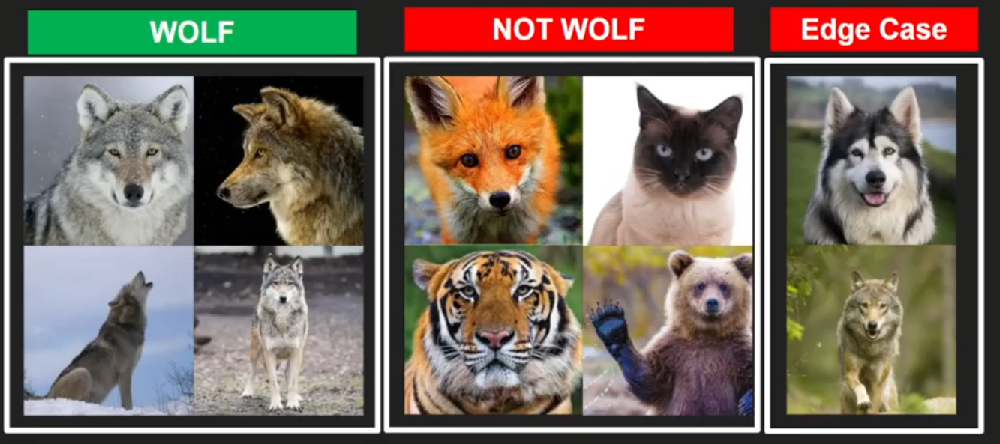
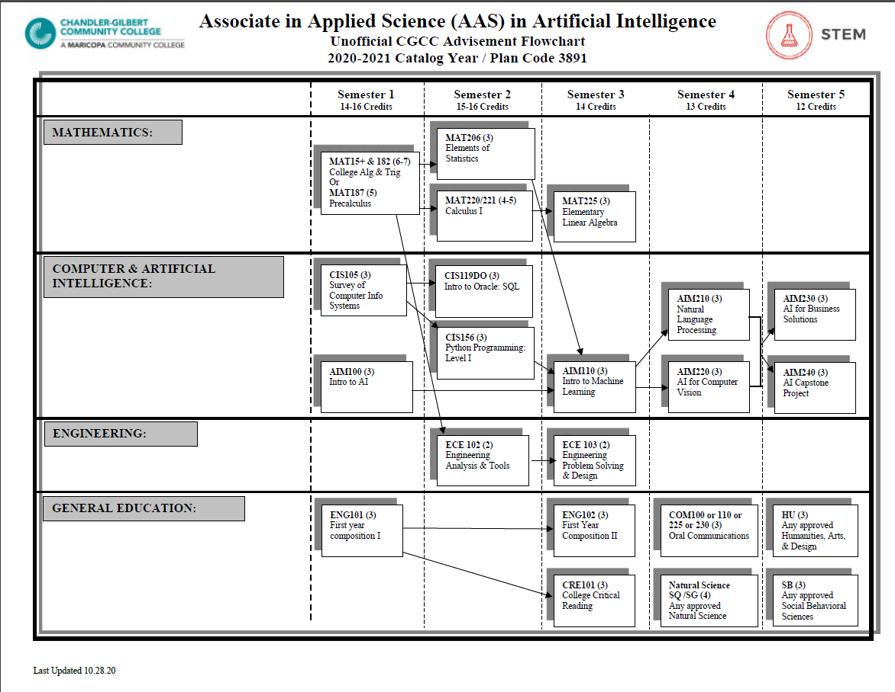

# Module 1 Notes For AIM 100

# What is AI

A computer system doing things that normally would require human intelligence.

# Types of AI

1. **Artificial Narrow Intelligence**
   - AI that simulates human intelligence at <u>one thing</u>
   - **Example:** When your camera can recognize you're in the camera frame and
     blur the background.
2. **Artificial General Intelligence**
   - AI that simulates human intelligence at <u>everything</u>
   - _Much less developed. Think Terminator and human-robots._

# General Notes

- [Syllabus](https://docs.google.com/presentation/d/18eNwOzWN99bpyex80OT1s_XhGAGPRnr3FIOHm7wtrzw/edit#slide=id.g1cf0eec0226_0_60)
- [AI Lecture Slideshow](https://docs.google.com/presentation/d/18eNwOzWN99bpyex80OT1s_XhGAGPRnr3FIOHm7wtrzw/edit#slide=id.g1cf0eec0226_0_60)
- [Goal-setting Article](https://legionathletics.com/goal-setting/)

## Wolf Example

```java
wolf_classifier() {
    // Does it have two ears?
    // Does it have wiskers?
    // Does it have four legs?
    // Does it have a grey pelt?
}
```

- Classifier depicts one thing from another.
- If all the values are true, it's classified as a "wolf".



The issue with this classifier is that it will not be able to differentiate
between a wolf and a dog that looks like a wolf.


- The way to get around this is **Supervised Learning**.

## Academic Pathway

- [CGC AI Page](https://cgc.edu/ai)
- [Academic Flowchart](https://www.cgc.edu/sites/default/files/documents/programs/program/aas-aim-flow-chart.pdf)
- [CGC Degree](https://www.cgc.edu/degrees-certificates/science-technology-engineering-and-mathematics/artificial-intelligence-and-machine-learning-3891-aas)



- AI involves a lot of math.

## AI Libraries

- [OpenVINO](https://www.intel.com/content/www/us/en/developer/tools/openvino-toolkit/overview.html)
  - [Documentation](https://docs.openvino.ai/latest/home.html)
- [Pandas](https://pandas.pydata.org/pandas-docs/stable/index.html)
- [OpenCV](https://opencv.org/)
- [Scikit-Learn](https://scikit-learn.org/stable/)
- [Numpy](https://numpy.org/devdocs/user/absolute_beginners.html)
- [PyTorch](https://pytorch.org/)
- [Keras](https://keras.io/)
- [Natural Language Toolkit](https://www.nltk.org/)
- [Hugging Face](https://huggingface.co/)

